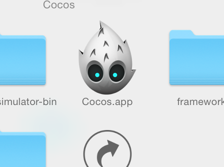
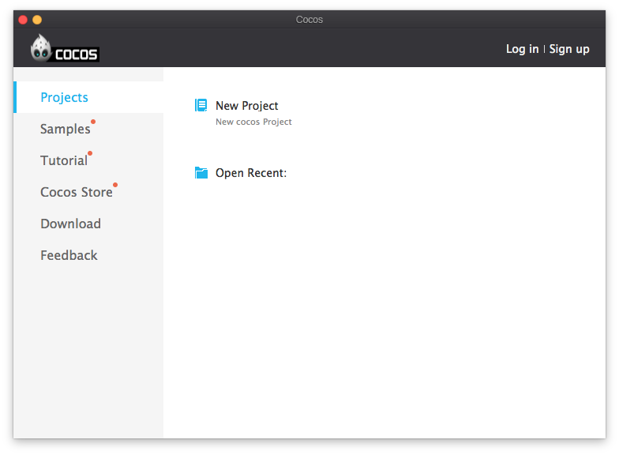
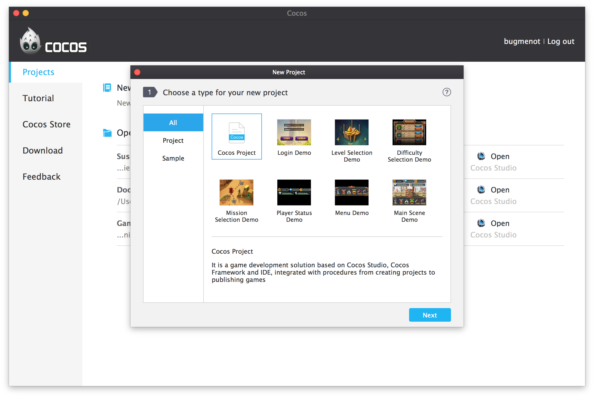
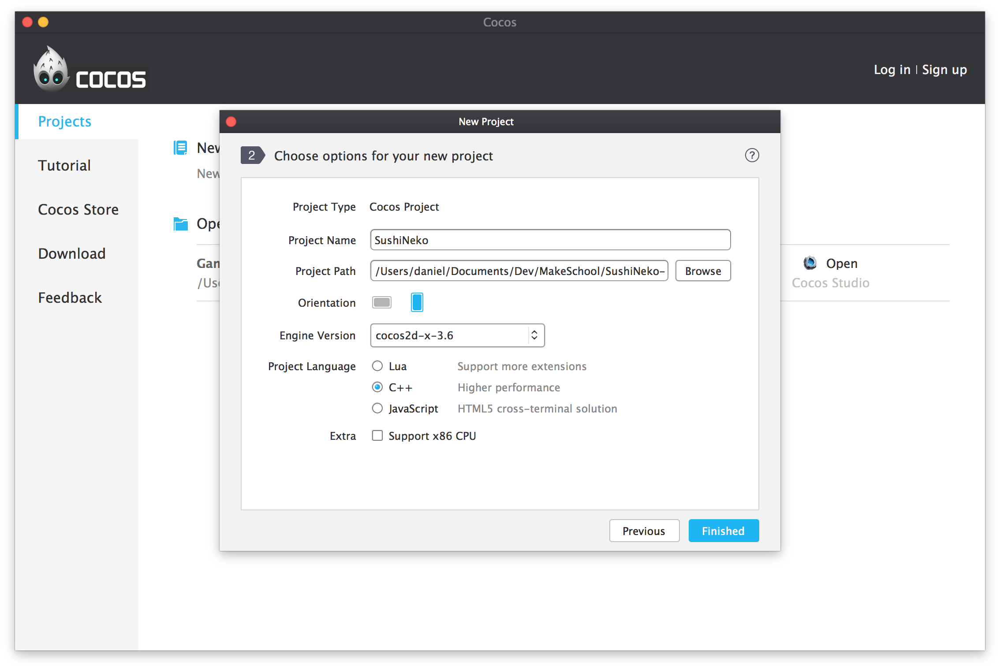
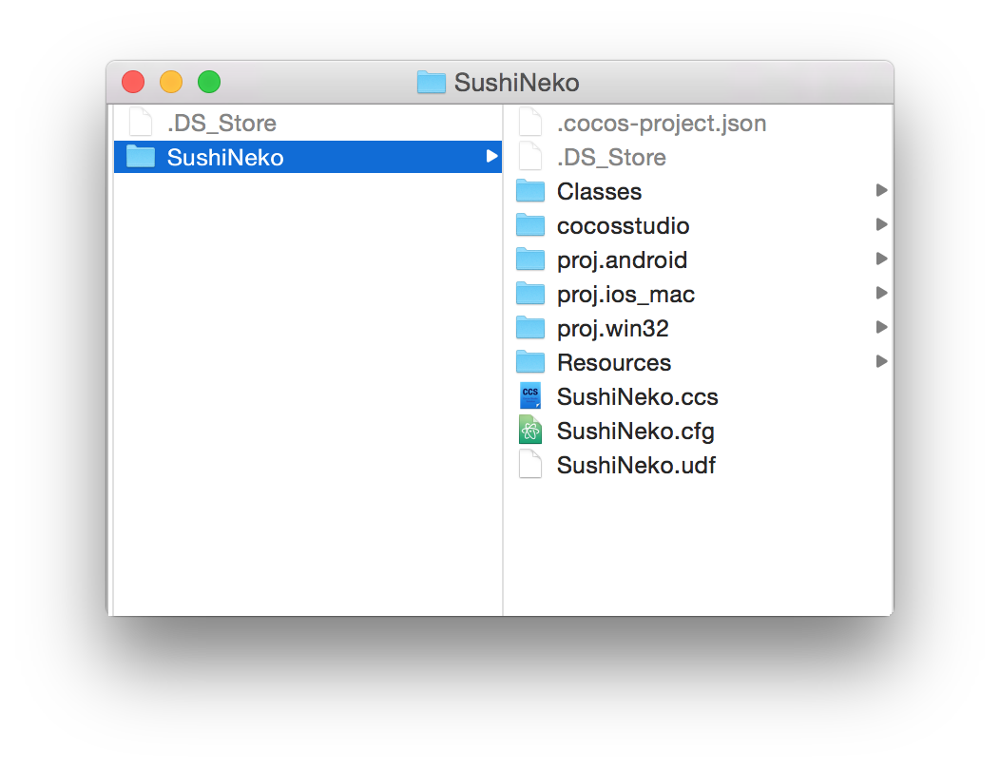
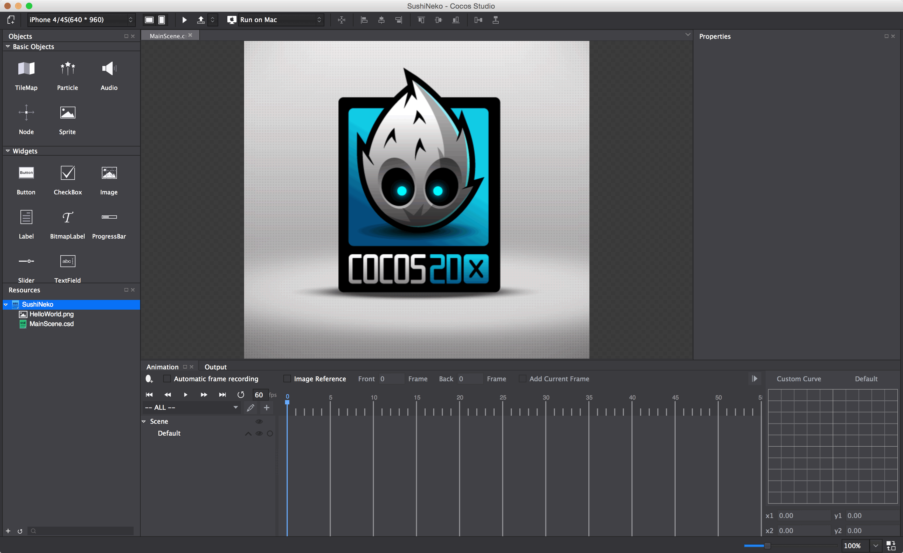
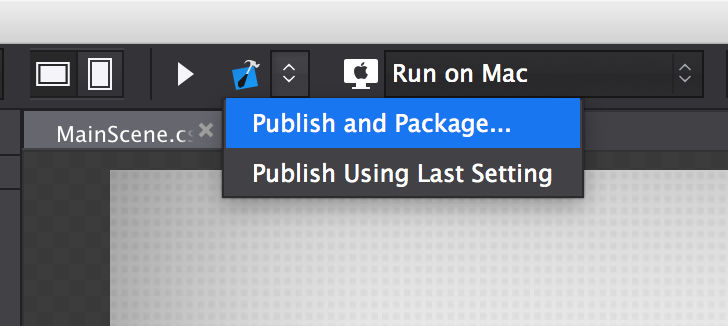
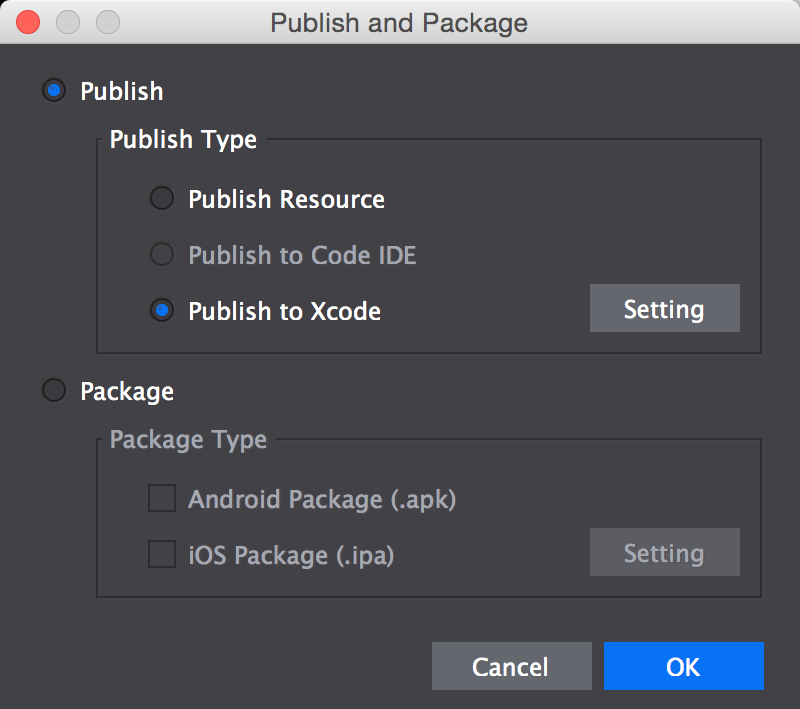
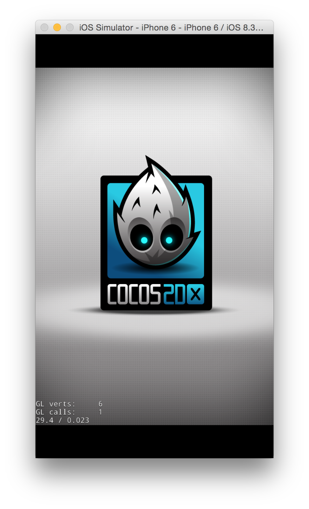

If you haven't used Cocos Studio before, you will need to install it.  For more information, on how to do that look at the tutorial [here](https://www.makeschool.com/tutorials/learn-cocos-studio-and-c-by-building-the-game-of-life/get-started-with-cocos-studio).

In fact, if you haven't used Cocos Studio and Cocos2d-x before, you might find it easier to start with the [Game of Life tutorial](https://www.makeschool.com/tutorials/learn-cocos-studio-and-c-by-building-the-game-of-life/what-game-of-life) instead.

Create a New Project
======================

Let's start the work on our game by creating a new Cocos Studio project. 

> [action]
> 
Open the Cocos App:
>

>
Switch to the *Projects* tab and click new project:
>

>
Create a new Cocos Project:
>

>
Name your new project *SushiNeko*. Select the latest engine version, and set the orientation to portrait.  Make sure you select C++ as your project language. Set the Project Path to wherever you like, but remember  where you set it, so you can find it later!
>

Once the project is created, open
Finder and take a look at the folder structure of your project. If you
can't find your project in Finder, search for it using Spotlight at the
top right of your screen. 

The folder structure should look something
like this:

Cocos Studio created a new folder called *SushiNeko*. Inside it
is a Cocos Studio project named *SushiNeko.ccs*.  It also created an Eclipse-based Android project in *proj.android*, an OSX and iOS Xcode project in *proj.ios_mac* and a Windows and Windows Phone Visual Studio project in *proj.win32*. The C++ classes you'll be writing are stored in the *Classes* directory, which is read by all three projects.  The assets and resources used by your game (like images, fonts, sounds and Cocos Studio binary files) are kept in the *Resources* directory.

The default Cocos Studio project comes with one scene, *MainScene.csd*. Your empty project should look like this:

Testing your setup
======================

> [action]
> 
Let’s make sure everything was generated correctly. Click on the *Publish and Package* button in Cocos Studio:

> [action]
> 
Change the Publish Type to *Publish to Xcode* and click *OK*

> [action]
> 
Now navigate to the *proj.ios-mac* directory and open *SushiNeko.xcodeproj* to view the project in Xcode. Press the play button in Xcode to run the project on the iOS Simulator.

Verify it shows the Cocos2d-x logo:

Congratulations! Now you have run your first Cocos Studio project and
you know your tools are working.
