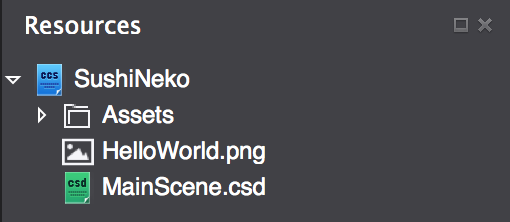
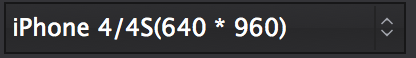
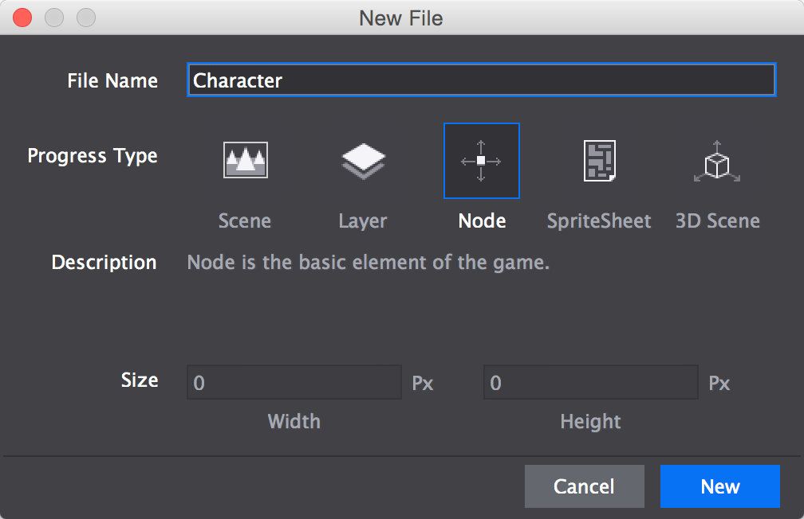
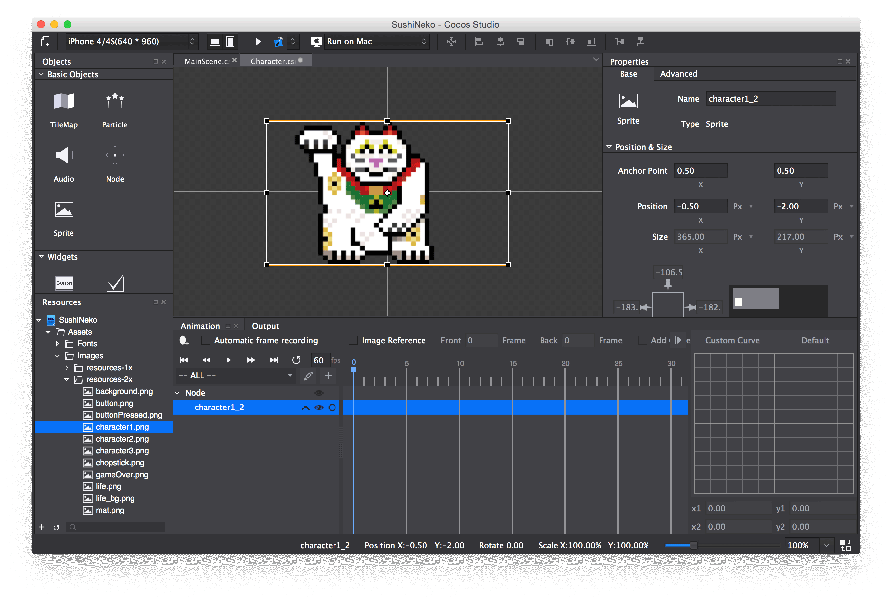
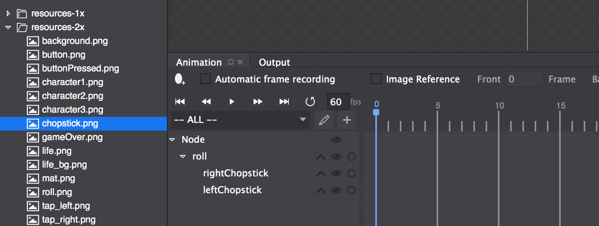
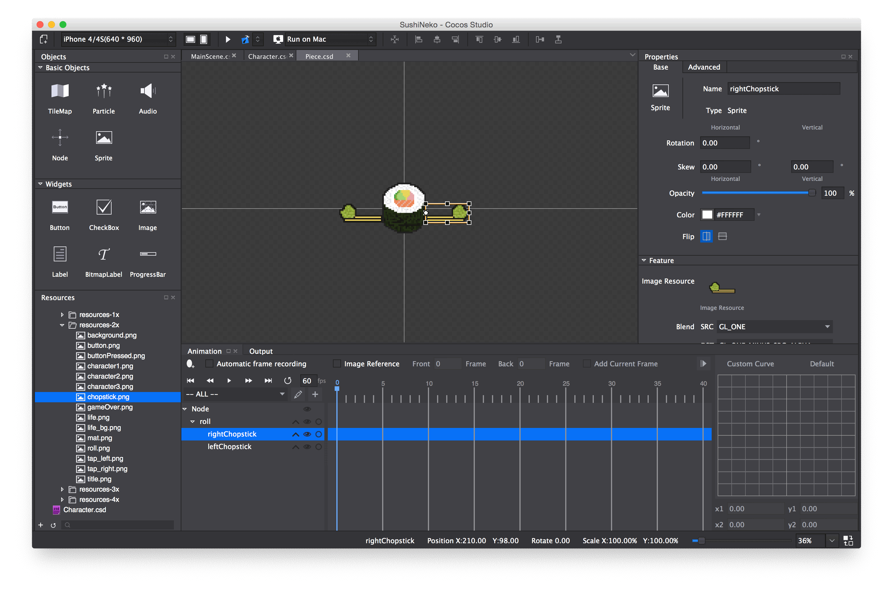
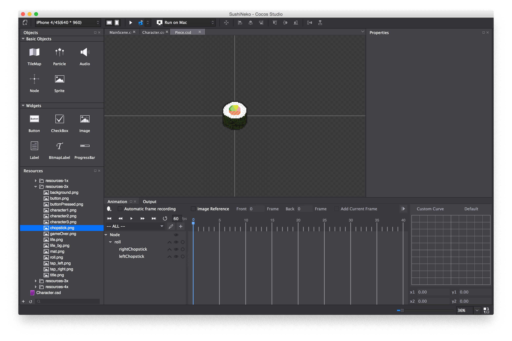

If you haven't used Cocos Studio before, you should first read up on the interface [here](https://www.makeschool.com/tutorials/learn-cocos-studio-and-c-by-building-the-game-of-life/cocos-studio-user-interface).

Adding Artwork
==============

To get started, [download our art pack](Assets.zip). Add the art pack you just downloaded to your Cocos Studio project by first unpacking the archive, then drag the folder onto the Resources Panel in Cocos Studio. Alternatively you can right click in the Resources Browser and *Import Resources...*.

Now open *MainScene.csd* and highlight Default in the timeline.
Hit the delete key - you should end up with a black screen. You just deleted the default background image, but note that you cannot delete the root Scene. 

In the Resources Browser in the left panel, find *HelloWorld.png* and delete it - you don't need it anymore.

Check to make sure that your design resolution (in the top-left hand corner) is set to *960 x 640*. This is the resolution at which we'll design the game in Cocos Studio.

Create the Character
====================

Now that we have art, create a new *CSD-File* named *Character* of type Node. To do that, either navigate to *File->New File* or just use the keyboard shortcut *⌘N*.

Now we need to add a *Sprite* to the node to display the image of our cat. We're designing in iPhone 4 / 4s resolution, which is 960 x 640. That resolution uses *2x* assets, so every image we use will be from the *resources-2x* directory. Then later we'll instruct Cocos2d-x to load the correct asset-size based on the actual resolution of the device that the game is running on.

Navigate in the resources browser to *Assets/Images/resources-2x/* and drag *character1.png* into the scene. The result should look something like this:

Change the name of the dragged sprite to *Cat*.  It's a good idea in general to give custom names to all your objects in Cocos Studio, because later you can reference them in code by name.

Set the *position* to (0, 0). Now set the *anchor point* to (1, 0) so that it is positioned relative to its bottom-right corner. We'll see how this makes things easier later, when we set up the *MainScene*.

After we're done making the core gameplay, we'll come back to this file to create some animations for the cat.

Now it's time to create the sushi pieces that will get chopped, and the associated obstacles for the player to dodge.

Create an Obstacle Piece
========================

Create a *CSD-File* named *Piece* of type Node.

Drag in *roll.png* from the *resources-2x* directory in the resources panel. Name it "roll". Also drag in two *chopstick.png* from the resources panel.  Make the chopsticks children of the roll by dragging the timeline text into the roll timeline text. Name one "rightChopstick" and the other "leftChopstick".

Your timeline should look like this:

It's time to position our sprites correctly! Set the roll's *position* to (0, 0).

Now lets move on to the left chopstick. Set its *anchor point* to (1.0, 0.5) and its *position* in relative percentage of parent container to (0, 40).

Let's set up the right chopstick. Set its *anchor point* to (0, 0.5). Set the *position* (also as a *percentage*) to (100, 40). Finally, click the *flip horizontal* button. This allows us to use the same asset for both chopsticks and save a little bit of memory.

The end result should look something like this:

The last thing we need to do is uncheck the *Visible* box of both chopsticks. We're going to make them visible programatically, but for now we want them both to be invisble.

So now the piece should look like this:

Let's move on to setting up the *MainScene* in the next step!
