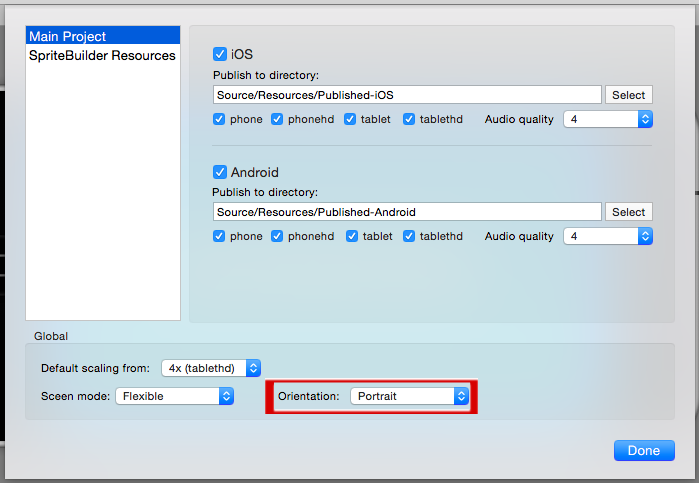
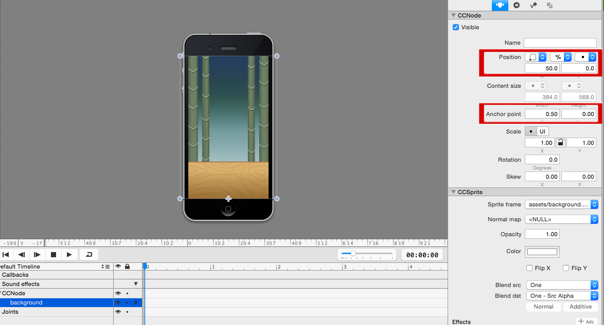
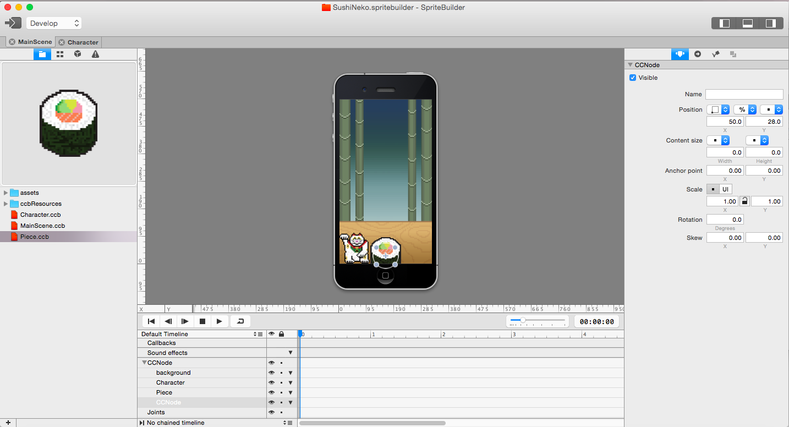
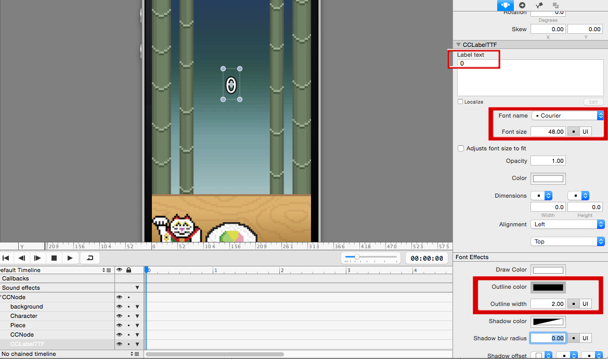
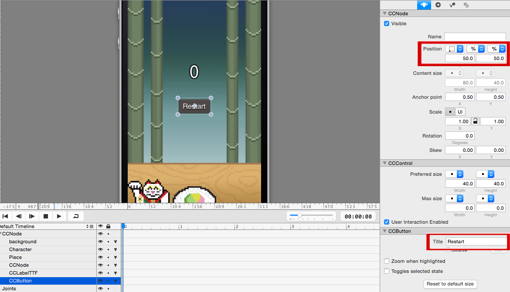
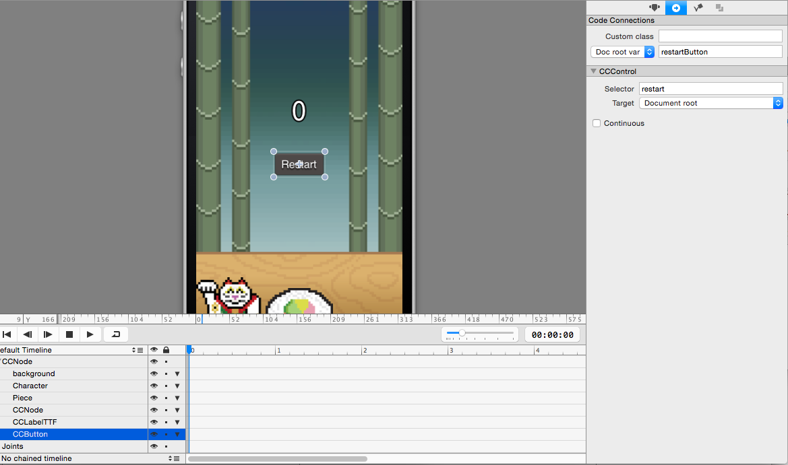
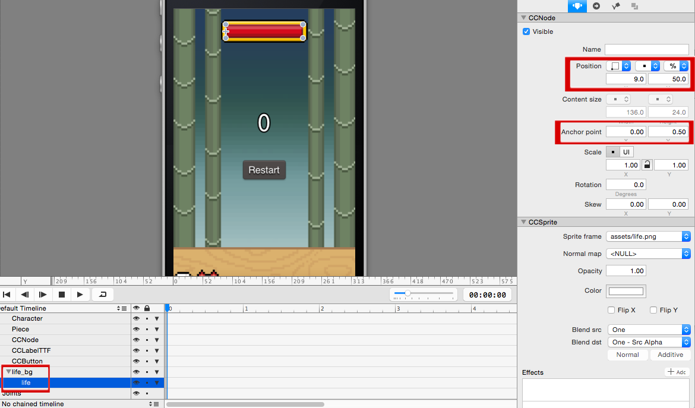

**Setting Up MainScene.ccb**

Open up `MainScene.ccb`. You'll notice that it defaults to landscape mode. We'll change the project settings before we get started.

Open the project settings and change the *orientation*:

Remove the "SpriteBuilder" label and gradient node from *MainScene* so we end up with a blank (black) stage.

**Add the Background Image**

Now add the background image by dragging `background.png` onto the scene. Set its *position* to `(50%, 0)` and its *anchor point* to `(0.5, 0)`. This will ensure that the the background image is centered on the bottom edge of all devices.

**Add the Character**

Drag `Character.ccb` onto the scene. Set its *position* to `(50%, 0)` and create a `doc root var` code connection to `character`.

**Setup the Sushi Stack**

We are about to setup the necessary nodes for the sushi stack. First we'll add a roll and position its bottom slightly off the screen. This roll will serve as our base (similar to the tree stump in Timberman). Then we'll add an empty *CCNode* and position it so we have a reference point to programmatically build up our sushi stack.  Create a `doc root var` code connection to `piecesNode` in the empty *CCNode* so we can use it programmatically later.

Drag `Piece.ccb` onto the scene. Set its *position* to `(50%, -30)` and its *anchor point* to `(0.5, 0)`.

Drag in a *Node* from the *node library* pane on the left side of SpriteBuilder onto the scene. Set its *position* to `(50%, 28)` and its *anchor point* to `(0.5, 0)`.

Your scene and timeline should now look like this:

To complete the MainScene we still need to add a score label, restart button, and timer bar.

**Add a Score Label**

Drag a *Label TTF* from the *node library* pane on the left side of SpriteBuilder onto the scene. Set its *position* to `(50%, 65%)`. Set the following properties:

1. *Label text* to `0`
2. *Font name* to `Courier`
3. *Font size* to `48`
4. *Outline color* to `Black`
5. *Outline width* to `2`

We'll need to be able to change the label with each obstacle the player successfully passes so create a `doc root var` code connection to `scoreLabel`.

**Add a Restart Button**

It's easier to setup and position a button from SpriteBuilder than doing it from code. Whenever a game over is triggered, we'll make the button visible.

Drag a *Button* from the *node library* pane on the left side of SpriteBuilder onto the scene. Set its *position* to `(50%, 50%)` and *title* to `Restart`.

Create a `doc root var` code connection to `restartButton` so we can flip the visibility after a game over. Also set the *selector* to `restart` and the *target* to `Document root`. This will trigger the `restart` method of `MainScene.swift` whenever the button is pressed.

Uncheck the *visible* box for now.

**Add a Timer Bar**

Drag `life_bg.png` onto the scene. Set its *reference corner* to `top-left` and its *position* to `(50%, 40)`. This will ensure it is centered and near the top of the screen on all devices.

Drag `life.png` onto the timeline as a child of `life_bg`. This will serve as our remaining time. Set its *position* to `(9, 50%)` and *anchor point* to `(0, 0.5)`. We will be changing the *x scale* via code to reflect the current amount of time left. The anchor point will ensure the left side is always positioned near the left edge of the life_bg border.

Your scene and timeline should now look like this:

Congratulations! You have finished setting up everything in SpriteBuilder for our basic gameplay demo. We'll come back to SpriteBuilder to polish up things after we get the code working.
