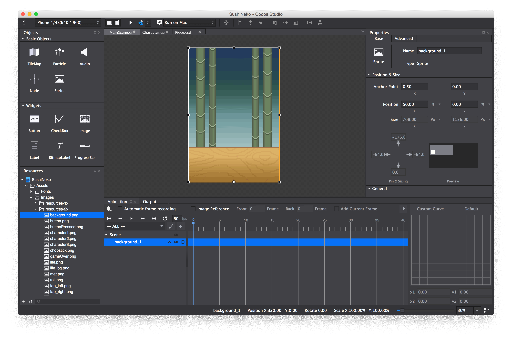
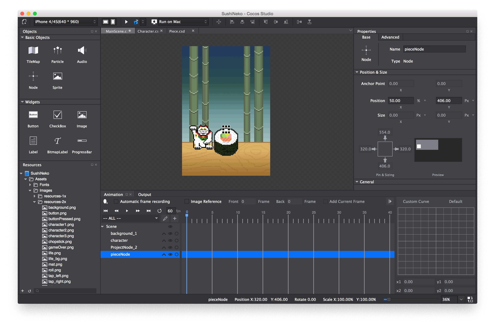
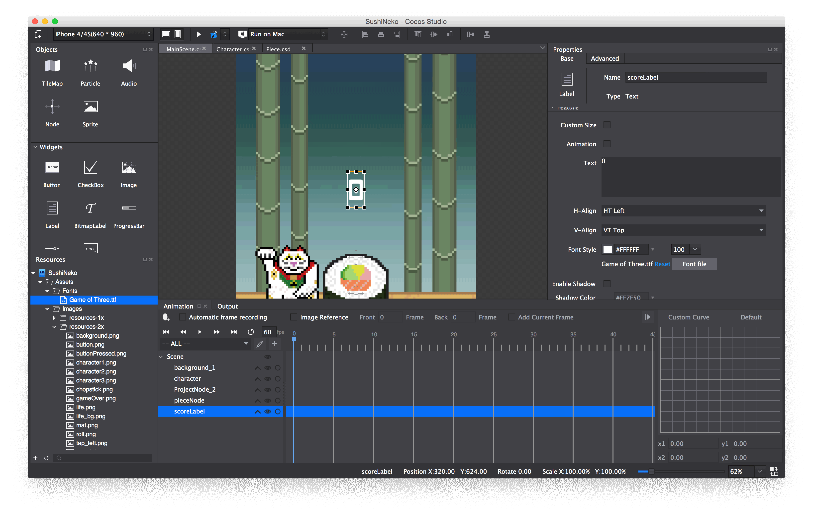
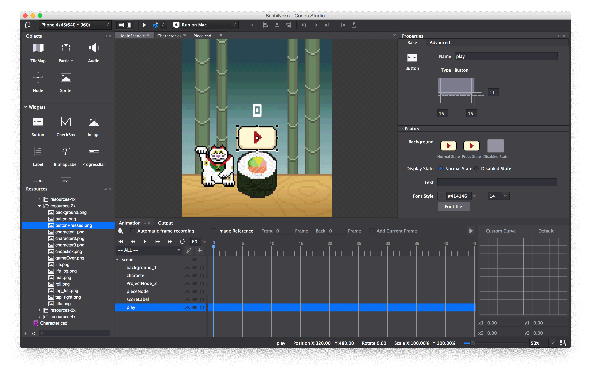
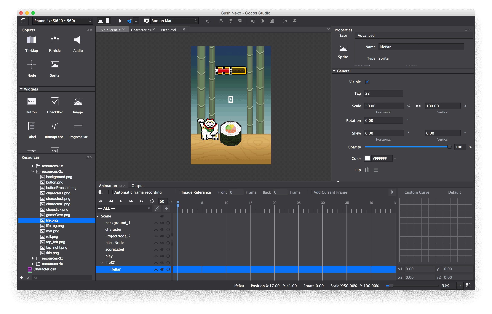
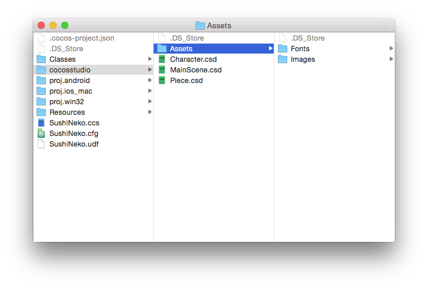
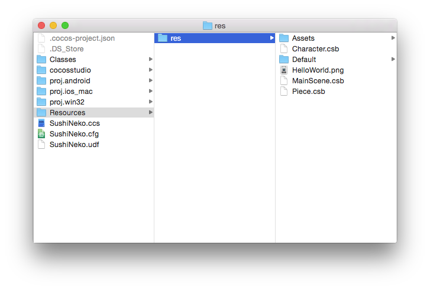

> [action]
> 
Open *MainScene.csd*. 

Add a Background
================

> [action]
> 
Now add the background image by dragging *background.png* onto the scene. Set its *anchor point* to (0.5, 0) and its *position* in *percentage* to (50, 0). This will ensure that the the background image is centered on the bottom edge of all devices.

Add the Character and Sushi Stack
=================================

> [action]
> 
Drag Character.csd onto the scene. Name it "character" and set its *x-position* to 50% and it's *y-position* to 230 px (*not percentage*).

We are about to set up the necessary nodes for the sushi stack. First we'll add a static roll and position it. This roll will serve as our base (similar to the tree stump in Timberman). Then we'll add an empty *Node* and position it so we have a reference point to programmatically build up our sushi stack.  

> [action]
> 
Drag Piece.csd onto the scene. Set the *x-position* to 50% and the *y-position* to 292px.

> 
Drag in a *Node* from the *Objects Panel* on the left side of Cocos Studio.  Name it "pieceNode". Set its *x-position* to 50% and its *y-position* to 406px.  

Your scene and timeline should now look like this:

To complete the MainScene we still need to add a score label, restart button, and timer bar.

Add Some UI
===========

> [action]
> 
Drag a *Label* (not *BitmapLabel*) from the *Widgets* pane onto the scene. Name it *scoreLabel* Set its *position* to `(50%, 65%)`. Set the *font file* to "Game of Three.ttf". You can find it in *Assets/Fonts*. Set the *text* to 0 and the *font size* to 100. This label will show how many successful chops the player has made on the sushi tower.

##Add a Restart Button

> [action]
> 
Drag a *Button* from the *Widgets* pane on the left side of Cocos Studio onto the scene. Name it "play". Set its *size* to (203, 126). Set its *position* to (50%, 50%). and *title* to `Restart`. The *text* should say "Button" - remove that. For the *normal state* drag over *button.png*. For *press state* drag over *buttonPressed.png*. 

> [action]
> 
Uncheck the *visible* box for now.

##Add a Timer Bar

> [action]
> 
Drag *life_bg.png* onto the scene. Name it "lifeBG". Set the *anchor point* to (0.5, 1.0) and its *position* to (50%, 98%). This will ensure it is centered and near the top of the screen on all devices.

> 
Drag *life.png* onto the scene and set it as a child of *lifeBG*. Name it "lifeBar". This sprite will show the remaining time. Set its *anchor point* to (0, 0.5)  Set the *x-postion* to 17px and the *y-position* to 50%. This should center the red life bar on its background.

We will be changing the *Horizontal Scale %* in code to reflect the current amount of time remaining. The anchor point will ensure the left side is always positioned near the left edge of the life_bg border. 

> [action]
> 
For now, set the *Horizontal Scale %* to 50.

Your scene and timeline should now look like this:

Congratulations! You have finished setting up everything in Cocos Studio for our basic gameplay demo. We'll come back to Cocos Studio to polish up things after we get the code working.

Copy Resources
=======================

> [action]
> 
Now save, and publish to Xcode.

We have to do one more thing before we start coding. The way Cocos Studio works, it only publishes resources that are actually used in Cocos Studio. So far we've only used *2x* sized assets from the *resources-2x* directory. But we want to be able to use all the asset sizes in our project, depending on the resolution of the device.

To make sure we can access all the resources in Xcode, we'll copy the Assets directory from where Cocos Studio reads them into the publish directory.

> [action]
> 
Navigate to your project directory and open *cocosstudio*. Copy the *Assets* directory.

> [action]
> 
Then open *Resources* and *res*. Paste the Assets directory here. Choose replace if it asks you whether you'd like to replace Assets.

Now all the assets from the art pack will be accessible in your Xcode project.
