Time to code! In this step we are going to hook up the UI we've created in Cocos Studio with the game logic we're going to code in Xcode.

> [action]
Open your Xcode project if it isn't already. 

Your Xcode project is contained inside the *proj.ios_mac* sub-directory in the directory where your Cocos Studio project lives. If you don't remember where you saved it, search for your project name *SushiNeko.xcodeproj* in Spotlight (magnifying glass at the top right of your Mac's screen).

First we're going to make some changes to the generated template code to make the game work on any device resolution.

Modify AppDelegate.cpp
======================

First we will modify our AppDelegate class.  The AppDelegate is the class that handles interfacing with the operating system.  For example, `void AppDelegate::applicationDidEnterBackground() ` is called every time your game is backgrounded.

We're going to modify `bool AppDelegate::applicationDidFinishLaunching()`. This method is called the first time your game is loaded, and is where most of our game-specific Cocos2d-x setup occurs. 

> [action]
Change this line:
>
	director->getOpenGLView()->setDesignResolutionSize(640, 960, ResolutionPolicy::SHOW_ALL);
>	
to look like this:
>
	glview->setDesignResolutionSize(640, 960, ResolutionPolicy::FIXED_WIDTH);
	
This will make sure that the game won't be letterboxed (black bars appearing on the top and bottom) for the various iPhone resolutions. Notice that the design resolution here is the same as what we have set in Cocos Studio!

Now we'll add in the code that will tell Cocos2d-x where to look for assets for various screen resolutions.

Below this line:

	FileUtils::getInstance()->addSearchPath("res"); 
	
Add the following:

	std::vector<std::string> searchResolutionsOrder(1);
    
    cocos2d::Size targetSize = glview->getFrameSize();
    
    if (targetSize.height < 481.0f)
    {
        searchResolutionsOrder[0] = "resources-1x";
    }
    else if (targetSize.height < 1137.0f)
    {
        searchResolutionsOrder[0] = "resources-2x";
    }
    else if (targetSize.height < 2047.0f)
    {
        searchResolutionsOrder[0] = "resources-3x";
    }
    else
    {
        searchResolutionsOrder[0] = "resources-4x";
    }
    
    FileUtils::getInstance()->setSearchResolutionsOrder(searchResolutionsOrder);

This code tells Cocos2d-x to use different assets depending on the pixel height of the display.  For example, if the height is between 1137 and 2047 pixels, it will load images from the *resources-3x* directory.

Modify HelloWorldScene.cpp
==========================

Because of a bug in Cocos2d-x (specifically the code that reads our Cocos Studio files), we have to add a bit of code to ensure that the positions of our objects that we created in Cocos Studio are correctly repositioned for various resolutions.

> [action]
In *HelloWorldScene.cpp*, right below this line: `auto rootNode = CSLoader::createNode("MainScene.csb");`
>
Add the following:
>
    Size size = Director::getInstance()->getVisibleSize();
    rootNode->setContentSize(size);
    ui::Helper::doLayout(rootNode);
    
In general, these lines will have to be added after loading any new scene from a *.csb* file until the bug is fixed!

Press the play button to see the UI of your game in the iOS simulator! 

It should look something like this:

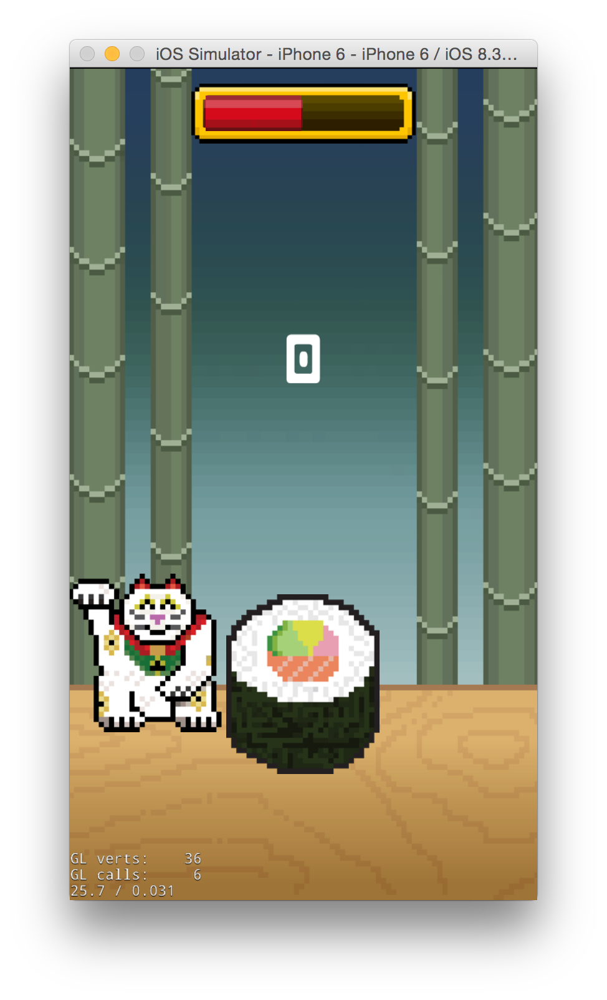

Rename HelloWorldScene
=====================

Unfortunately, the default Cocos Studio new project template gives the main scene the name `HelloWorldScene`. Because it's a good practice to give classes names that describe their function, we're going to rename `HelloWorldScene` to `MainScene`. Also that way the scene in Cocos Studio, *MainScene.csd*, matches the scene in code. This is a good opportunity to learn about Xcode's project search feature.

Click the third tab on Xcode's left panel. 

Search for *HelloWorldScene*. You should find two results. 

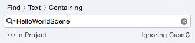

Change the search from *Find > Text > Containing* to *Replace > Text > Containing*.  

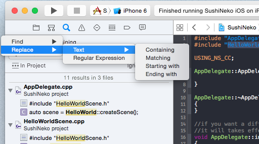

Use the *Replace All* button to replace the instances of *HelloWorldScene* with *MainScene*. 

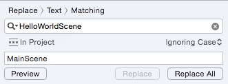

Xcode may ask you if you want to take a snapshot before performing the operation. You should *disable* snapshotting - it's a form of version control, but not a very good one. Instead consider using [git.](https://git-scm.com/).

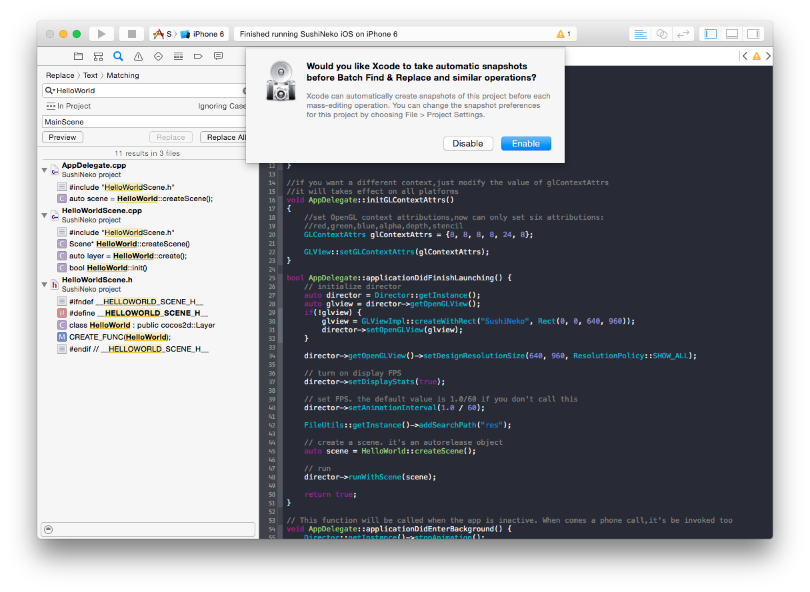

Now do the same thing, except replace all instances of *HelloWorld* with *MainScene*. 

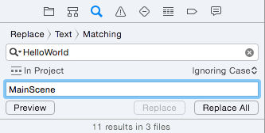

Generally speaking, you should be very careful using replace all functionality in text editors - it's very easy to unintentionally replace something that you didn't intend to. It's a better practice to check each result individually and use the *Replace* button to replace one at a time, instead of doing all of them with *Replace All*. However, for the purposes of this tutorial, doing a *Replace All* was okay.

Finally, rename *HelloWorldScene.h* and *HelloWorldScene.cpp* to *MainScene.h* and *MainScene.cpp*.  It's easy to rename files in Xcode, just click the file, hit the enter key, then type the name.

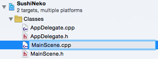

You will likely often find yourself using Xcode's Find feature - it's a very fast way to look for a piece of code.

Set Up Custom Classes in Cocos Studio
=====================================

Now let's go back to our Cocos Studio project. We're going to create *Custom Class* linkages for the Character and Piece objects we made.  This will allow us to define custom behaviors for those objects in code.  We didn't do this step earlier because setting a custom class in Cocos Studio will cause the game to crash when its run if the custom classes are not also defined in code.

Open *Character.csd*.  Click the root (topmost) node in the timeline.  It's called Node.  Then, in the *Properties* panel on the right, click the *Advanced* tab.  Set the *Custom Class* to Character.

It looks like this:

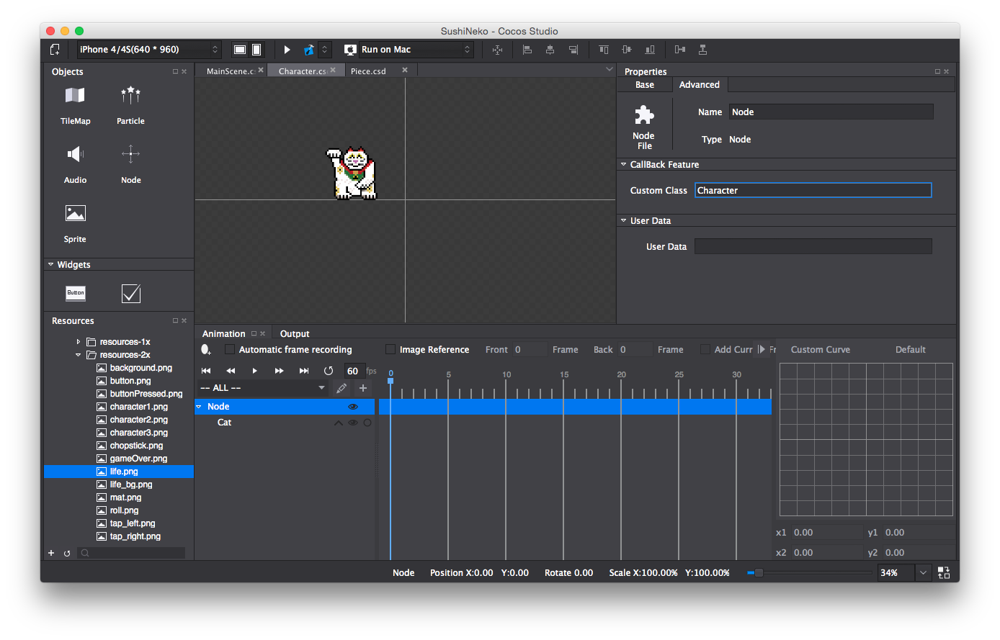

Now do the exact same steps for *Piece.csd* - set its custom class to Piece.

**Save and publish the Cocos Studio project before moving on!**

Create Some Classes
===================

Now we'll create the code for the custom classes we just set up in Cocos Studio. We'll need four new classes for our game right now:

1. `Character`
2. `CharacterReader`
3. `Piece`
4. `PieceReader`

In Xcode, go to *File > New > File*. Select *C++ File*.  Name it *Character*.

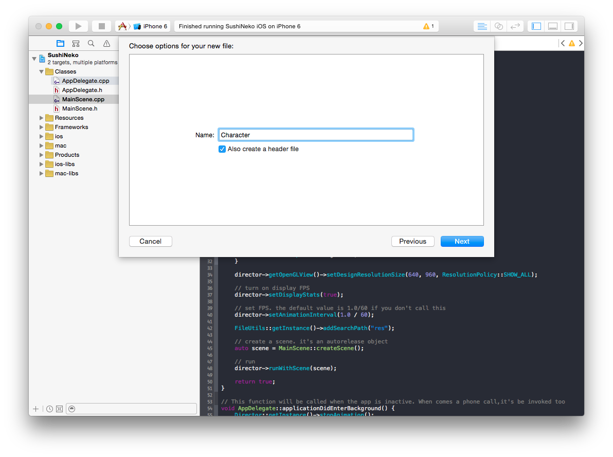

Save it in your *Classes* folder. Check the box labeled SushiNeko Mac so that this file is available in both the iOS and Mac targets.

Define the `Character` class as a subclass of `Node` in *Character.h*.

	#ifndef __SushiNeko__Character__
	#define __SushiNeko__Character__

	#include "cocos2d.h"

	class Character : public cocos2d::Node
	{
	public:
	    CREATE_FUNC(Character);
	    
	protected:
	    
	};
	
	#endif /* defined(__SushiNeko__Character__) */

Now let's create the CharacterReader class.  Whenver we create an object in Cocos Studio and give it custom behaviors by linking it to a custom class, we have to create a corresponding Reader class to load and link the Cocos Studio object with its associated code. Create a new C++ file called *CharacterReader*. 

Add the following code in-between the header guards of *CharacterReader.h*

	#include "cocos2d.h"
	#include "cocostudio/WidgetReader/NodeReader/NodeReader.h"

	class CharacterReader : public cocostudio::NodeReader
	{
	public:
	    static CharacterReader* getInstance();
	    static void purge();
	    cocos2d::Node* createNodeWithFlatBuffers(const flatbuffers::Table* nodeOptions);
	};

Then in *CharacterReader.cpp*, add the following:

	#include "CharacterReader.h"
	#include "Character.h"

	using namespace cocos2d;

	static CharacterReader* _instanceCharacterReader = nullptr;

	CharacterReader* CharacterReader::getInstance()
	{
	    if (!_instanceCharacterReader)
	    {
	        _instanceCharacterReader = new CharacterReader();
	    }
	    return _instanceCharacterReader;
	}

	void CharacterReader::purge()
	{
	    CC_SAFE_DELETE(_instanceCharacterReader);
	}

	Node* CharacterReader::createNodeWithFlatBuffers(const flatbuffers::Table *nodeOptions)
	{
	    Character* node = Character::create();
	    setPropsWithFlatBuffers(node, nodeOptions);
	    return node;
	}

This is all boilerplate code required by Cocos2d-x to read Cocos Studio objects.  The code will be the same for every reader class, except you will replace all instances of `CharacterReader` with `YourClassReader` and `Character` with `YourClass`.  Because the code is the same and you won't really interact with it much, it's not super important to understand it.  But if you're interested, here's some additional information:

> [info]
> CharacterReader is a singleton, which means that (when used correctly) there will only ever be a single instance of it.  The line 
> 
> 	`static CharacterReader* _instanceCharacterReader = nullptr;`
> 
> Together with the implementation of `CharacterReader::getInstance()` are the canonical way to create singletons in Cocos2d-x projects. When interacting with singletons, instead of creating new objects with `new` or `create()`, instead you always retrieve the single instance with `getInstance()` and interact with that.
> 
> Purge is called by Cocos2d-x when the reader is no longer needed, to delete it.
> 
> `createNodeWithFlatBuffers` is what's called by the Cocos2d-x code to create and initialize the object with the properties set in Cocos Studio. 

**Follow the same steps to create the `Piece` and `PieceReader` classes.**

After you've done that, we have to tell Cocos2d-x where to find the reader classes.  Open *MainScene.cpp* and below these lines in `init`:

    if ( !Layer::init() )
    {
        return false;
    }

Add the following:

    // Register the readers for our custom classes
    // Be very careful to do CharacterReader::getInstance, not CharacterReader::getInstance() which will crash
    CSLoader* instance = CSLoader::getInstance();
    instance->registReaderObject("CharacterReader", (ObjectFactory::Instance) CharacterReader::getInstance);
    instance->registReaderObject("PieceReader", (ObjectFactory::Instance) PieceReader::getInstance);

You'll notice that the compiler complains, it will say something like "Use of undeclared identifier 'CharacterReader'".  That's because we haven't yet told the compiler about our `CharacterReader` and `PieceReader` classes.  To do that, add the following to the other `#includes` commands:

	#include "CharacterReader.h"
	#include "PieceReader.h"

Try running again.  It might look the same, but as long as it doesn't crash, that means that our `Character` and `Piece` custom classes are working!

Building the Sushi Tower
========================

We'll be building the game's code piece by piece. Our plan is to:

1. Build the sushi tower of obstacles
2. Add touch controls to move the character
3. Randomize the obstacle side
4. Move down the sushi tower with every touch
5. Detect collisions & trigger a game over
6. Get the timer working
7. Update the score

We'll build the sushi tower up in the `init` method so that it's added before `MainScene` is shown to the player.

Our goal is to create a tower ten pieces high. When we start moving that tower down, we'll actually move the bottom piece back to the top of the tower instead of removing it from the scene. This will save a bit of processing power since we will be reusing the same objects.

We will need two instance variables to create the tower - one is the `pieceNode` that we've already created in Cocos Studio - we'll add sushi roll pieces to that node.  The second is a `Vector` of pieces called `pieces`. We'll store references to the pieces in the tower in the `pieces` vector.

Go to *MainScene.h* and add a `private:` declaration below `CREATE_FUNC(MainScene);`

Below the `private:` declaration, declare the following two instance variables:

    cocos2d::Node* pieceNode;
    cocos2d::Vector<Piece*> pieces;
    
The compiler will complain that it doesn't know what a `Piece*` is. Fix that by including `Piece.h` at the top.

Open *MainScene.cpp*. Near the end of `MainScene::init()` but before `addChild(rootNode);`, add the following:

	this->pieceNode = rootNode->getChildByName("pieceNode");
	
This grabs a reference to the `Node` labeled *pieceNode* in Cocos Studio and saves it in the variable `pieceNode`. The `this` is optional, but is good style because it makes it more clear that `pieceNode` is an instance variable of this class, `MainScene`.

Now we shall load ten instances of `Piece.csd` and position them so they build up a tower. Hoever, we have a problem. We need to know the height of the sushi roll so that we can stack them on top of each other. Recall that *Piece.csd* is actually a `Node`, and that the roll `Sprite` is a child of that `Node`.  So if we load a piece, and use the `getContentSize()` method, it will return the content size of the root `Node` (which is (0, 0)) instead of the content size of the roll.

We could just grab a reference to the underlying `Sprite` to get the height like this:

	piece->getChildByName("roll")->getContentSize().height;
	
But this code is fragile - if we changed the name of "roll" in Cocos Studio, then every place this line of code appears in our project would also have to change.  A better way to do it is to use the concept of [encapsulation](https://en.wikipedia.org/wiki/Encapsulation_(computer_programming)). The piece class should have a public method that returns the height of the roll.

We're going to create a new method in `Piece` called `getSpriteHeight()`.

So open *Piece.h* and under the `public:` keyword declare this:

	float getSpriteHeight();
	
Now flip to *Piece.cpp*. First, below `include "Piece.h` write:

	using namespace cocos2d;
	
This tells the compiler that it can infer the usage of the cocos2d namespace for all the code in *Piece.cpp*. We'll talk a bit more about that in a bit.  For now lets implement `getSpriteHeight()`:

	float Piece::getSpriteHeight()
	{   
	    // first grab a reference to the roll sprite
	    Sprite* roll = this->getChildByName<Sprite*>("roll");
	    
	    // then return the roll sprite's height
	    return roll->getContentSize().height;
	}

Remember the `using namespace cocos2d;` declaration at the top?  Without declaring `using namespace cocos2d` at the top, the `getChildByName` line would look like this:

	    // first grab a reference to the roll sprite
	    cocos2d::Sprite* roll = this->getChildByName<cocos2d::Sprite*>("roll");
	  
For this method it has saved us having to type `cocos2d::` twice. For others it can save us typing `cocos2d::` much more. Generally speaking, whenever implementing a class that interacts with Cocos2d-x, it makes sense to declare `using namespace cocos2d;` at the top.

Okay, now we can go back to *MainScene.cpp* to create our sushi tower.  Below where we assigned `pieceNode`, create a for loop that loops 10 times:

	for (int i = 0; i < 10; ++i)
	{

	}
	
Inside the loop, do the following.  Create a piece:

	Piece* piece = dynamic_cast<Piece*>(CSLoader::createNode("Piece.csb"));
	
Because `CSLoader::createNode()` returns a `Node`, we have to downcast it using `dynamic_cast` into a `Piece`. To learn more about the kinds of typecasting in C++, check out [this](http://www.cplusplus.com/doc/tutorial/typecasting/) article.

Next, create a `float` called `rollHeight` and assign the height of the roll using the `Piece` method that we just created.

Use `rollHeight` to set the position of the roll like this:

	piece->setPosition(0.0f, rollHeight / 2.0f * i);
	
We divide by `2.0f` because we don't want the rolls to be evenly spaced without overlapping - we want them to be stacked on top of each other.

Next, add the `piece` to both the `pieceNode` and our `pieces` `Vector`.

        this->pieceNode->addChild(piece);
        this->pieces.pushBack(piece);
  
> [info]     
> Note that instead of using the arrow syntax to add the piece to pieces, we use the dot syntax. That's because the pieces vector is declared as an object directly, not a pointer to an object. Look at the declaration in *MainScene.h*, it looks like this:
>
>	`cocos2d::Vector<Piece*> pieces;`
> 	
> If we were instead declaring `pieces` as a pointer to a `Vector`, it would look like this:
>
> 	`cocos2d::Vector<Piece*>* pieces;`
>
> Note the extra asterisk.  In general, directly declaring objects (instead of pointers to objects) is faster, though there's many reasons why one wouldn't. For further discussion on that topic, look at [this StackOverflow answer](http://stackoverflow.com/a/22146244). The most common reason we choose to use pointers to objects in Cocos2d-x is to preserve polymorphism.  

Your game should now look like this when you run it:

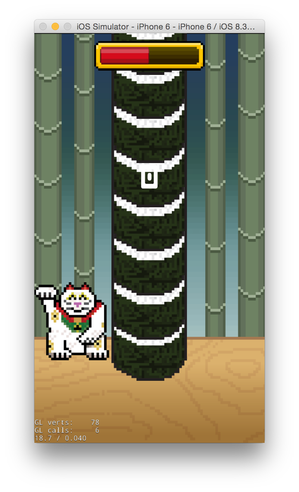

Now let's move on to adding touch handling.

Add Touch Handling
==================

Before adding touch handling, we first need a method we can call to move the `Character` to the right side of the screen and back.

First lets create an `enum` that will represent a side. The best place to put this new `enum` is actually a file we haven't created yet!

Create a new *Header File* (*File > New > File*) and name it *Constants.h.*  **Make sure to set the targets to both the iOS and Mac projects!** It's very common to declare new types and constant values that will are used by multiple classes in a single header file called *Constants* (or sometimes *Globals*). That way, multiple classes can use the same types without having to `#include` each other. This helps to maintain [separation of concerns](https://en.wikipedia.org/wiki/Separation_of_concerns). In our case, this new `enum` will be used by the `Character`, `Piece` and `MainScene` classes, but we don't want them all to have to `#include` each other unnecessarily.

Inside the header guards of *Constants.h*, create an `enum` called Side, like this:

	enum class Side
	{
	    Left,
	    Right,
	    None
	};
	
We will use these `enum` values to represent what side both the `Character` and the `Piece` obstacles are on.  

> [info]
> Enums are a great way to represent different states.  `Enum` stands for `enumeration`. Essentially an `enum` is just a integer, but instead of the values being assigned numbers, like `0`, `1` and `2`, they're human-readable, like `Left`, `Right` and `None`. Under the hood, however, they actually do have integer values. For example, `Left` is really the value `0`, `Right` is really the value `1` and `None` is really the value `2`.
> 
> Why do `enum`s exist?  They make code much more readable.  It's too difficult, as a human, to have to remember that a `Side` value of `0` actually means that the `Character` is on the left side of the screen, and that `1` means that the `Character` is on the right side.
> 
> Why not just use a `std::string` instead?  It's much slower to compare two `std::string` types, and they occupy more memory.  

Now, in *Character.h*, it's your job to declare a `protected` instance variable called `side` of type `Side` that represents which side of the screen the `Character` is on, and also public getter and setter methods to modify the value of `side`.

We'll use these methods from `MainScene` when we add in the touch handling.

> [solution]
> You should have added the following `public` methods to *Character.h*:
>
	void setSide(Side side);
	Side getSide();
>
> And this `protected` instance variable
>
	Side side;

Don't forget to `#include "Constants.h"`. Now add in the implementations of the getter and setter methods in *Character.cpp*.

> [solution]
> 
	Side Character::getSide()
	{
	    return this->side;
	}
>
	void Character::setSide(Side side)
	{
	    this->side = side;
	}

Okay, so the `Character` class has an instance variable that represents what side the character is on. But it doesn't actually move the `Character` on the screen! We'll be relying on a little trick to make this easy - setting the `scaleX` to *-1.0f* flips a sprite horizontally around its anchor point. Since `Character` already has an anchor point at the center of the screen, we can us this trick to flip it to the other side.

Modify `setSide` to appropriately flip the character to the right side of the screen if it's set to `Right` and back to the left side if it's set to `Left`.

> [solution]
> After `this->side = side;` you should have added something like this:
> 
	if (this->side == Side::Right)
	{
		this->setScaleX(-1.0f);
	}
	else
	{
		this->setScaleX(1.0f);
	}

Before we can start detecting touch events, `MainScene` needs to have a reference to the `Character` created in Cocos Studio, so that it can move the `Character` left and right. In *MainScene.h*, declare a `protected` `Character` instance variable, like this:

	Character* character;
	
This is all fine and dandy, but the compiler is probably complaining:
> Unknown type name 'Character'

We could fix this by writing `#include Character.h` in *MainScene.h*, but there's a better way!  Whenever possible, instead of including a source file into a header, it's better to forward declare the classes you need access to. You can read about C++ forward declaration [here](http://stackoverflow.com/a/4757718). It's a good idea because it speeds up your compilation time, separates declaration from implementation and fixes cyclic dependences between classes.

So above 

	class MainScene : public cocos2d::Layer
	
Forward declare `Character` like this:

	class Character;
	
Doing that tells the compiler that there's a `class` called `Character`, so that you can use that type name in your method and instance variable declarations. It doesn't need to worry about what `Character` actually is until the implementation of `MainScene`. So flip to *MainScene.cpp* and `#include Character.h` there.	    

We can grab the reference to the `Character` in the `init()` method. Right below where we intialized `this->pieceNode`, add this code:

    this->character = rootNode->getChildByName<Character*>("character");
    
`getChildByName` is a templated method (as indicated by the `<` and `>` characters). In this case, we can tell the method what kind of class we're getting, so that it can return that type, and we don't have to do any casting.  So we tell `getChildByName` that it's going to return a `Character*`, which means we don't have to use a `dynamic_cast` like we did when we instantiated the `Piece` objects for the tower.

Now we can start detecting touch events. In order to detect whether or not the touch is on the left or right side of the screen, we need to know the `contentSize` of the scene. But size information is yet not available to us in the `init()` method. Instead we'll have to do our touch handling setup in the `onEnter()` method, after the scene has been created and has size information. Go to *MainScene.h* and declare a new `protected` method: 

	void onEnter() override;
	
We use the `override` keyword to tell the compiler that we're overriding a superclass method.

Now in *MainScene.cpp*, implement `onEnter()`.

	void MainScene::onEnter()
	{
	    Layer::onEnter();
	}
	
When overriding superclass methods, it's very important to remember to call the superclass implementation, or things may break. In this case, the superclass of `MainScene` is `Layer`, so we call `Layer::onEnter();`

Now it's your job to create a `protected` method called `setupTouchHandling()`. It takes no parameters and returns `void`.

After you have declared `setupTouchHandling()` in *MainScene.h* and implemented an empty method in *MainScene.cpp*, call it from `onEnter()`.

> [solution]
> 
	void MainScene::onEnter()
	{
	    Layer::onEnter();
	    
	    this->setupTouchHandling();
	}

Now we shall fill in the contents of `setupTouchHandling()`. It should look like this:

	auto touchListener = EventListenerTouchOneByOne::create();
	    
	touchListener->onTouchBegan = [&](Touch* touch, Event* event)
	{
	   // get the location of the touch in the MainScene's coordinate system
	   Vec2 touchLocation = this->convertTouchToNodeSpace(touch);
	   
	   // check if the touch was on the left or right side of the screen
	   // move the character to the appropriate side
	   if (touchLocation.x < this->getContentSize().width / 2.0f)
	   {
	       this->character->setSide(Side::Left);
	   }
	   else
	   {
	       this->character->setSide(Side::Right);
	   }
	   
	   return true;
	};
	
	this->getEventDispatcher()->addEventListenerWithSceneGraphPriority(touchListener, this);
	
The `touchListener` is an `EventListenerTouchOneByOne` which means it will report touches to us one at a time. There's also `EventListenerTouchAllAtOnce` which reports multiple touches at the same time, which is helpful for games that can respond to multi-touch gestures.

Timberman is a fast-paced game, and we want it to be very responsive. So we're going to respond to the touch event right at the moment it's registered, which is why the character movement code is in the `onTouchBegan` lambda expression block.  There's also `onTouchMoved`, `onTouchEnded`, and `onTouchCancelled` which do what they sound like. Often the right one to use depends on context.

> [info]
> Notice that the code we write inside `onTouchBegan` isn't executed immediately - instead it's saved to be executed at a later date. This is a new feature in C++11 called a *lambda expression*, (also sometimes known as a *block*, *anonymous function* or *closure*). To learn more about them, check out [this article here](https://en.wikipedia.org/wiki/Anonymous_function#C.2B.2B_.28since_C.2B.2B11.29).

Inside the `touchBegan` block, we convert the touch from the global coordinate system to the node space of the scene. The way we can tell if the touch was on the left side on the screen by comparing the x-value to see if it's less than half the content size.

You should now be able to move the character from one side to another and back:

<!-- TODO: Uncomment when done editing P4

<video>
	<source src="https://s3.amazonaws.com/mgwu-misc/Sushi+Neko+Cpp/touchHandling.mov" type="video/mp4">
</video>

-->

Randomize Each Obstacle's Side
==============================
 
Let's set up the `Piece` class. Just like how we created the `side` property in `Character`, with `setSide` and `getSide` methods, we're going to do the same thing in `Piece`, except call it `setObstacleSide` and `getObstacleSide`.  Set up the instance variable, and the getter and setter methods - we'll talk about some additional functionality for the setter afterwards. Try to do this without looking at the solution code!

> [solution]
> 
> *Piece.h*
> 
 	public:
		void setObstacleSide(Side side);
		Side getObstacleSide(); 
>		
	protected:
		Side obstacleSide
>
>
*Piece.cpp*
>
	Side Piece::getObstacleSide()
	{
	    return this->obstacleSide;
	}
>
	void Piece::setObstacleSide(Side side)
	{
	    this->obstacleSide = side;
	}

Now let's make it so that when the obstacle side is set, either the `Left`, `Right` or `None` obstacle is visible, as appropriate.

First grab a reference to the `roll` sprite. Use that to get references to the `leftChopstick` and `rightChopstick`, which are both children of `roll`.

> [solution]
> 
    Sprite* roll = this->getChildByName<Sprite*>("roll");
>
    Sprite* leftChopstick = roll->getChildByName<Sprite*>("leftChopstick");
    Sprite* rightChopstick = roll->getChildByName<Sprite*>("rightChopstick");
    
Next, use a `switch` statement to set the visibility of the chopsticks appropriately for the given `side`. `switch` statements are a great way to do conditional code branching when a variable can only take one of a constant number of values.

Here's what the `switch` should look like for `setObstacleSide`:

	switch (this->obstacleSide)
	{
		case Side::None:
	   		break;
	            
	   case Side::Left:
	      	break;
	            
	   case Side::Right:
	     	break;
	}
	
> [info]
> 
> The equivalent if statement would look like this:
>
	if (this->obstacleSide == Side::None)
	{
>
	} 
	else if (this->obstacleSide == Side::Left)
	{
>	
	}
	else if (this->obstacleSide == Side::Right)
	{
>	
	}
It's a little bit more ugly, but it's actually also less performant.  Switch statements can jump straight to the correct code branch based on the value being switched on, whereas if / else statements have to evaluate through the various possible conditions until finding the correct one.

> [action]
> Use the switch statement and the `setVisible` method to set obstacle visibility correctly.

We want our obstacles (chopsticks) to randomly choose a side but we need to have a few rules to make sure the game is fair and we do not produce an impossible to pass sequence. Our rules for obstacle generation are:

1. A piece has no obstacle if the previous piece had one
2. Right should appear 45% of the time an obstacle can be added
3. Left should appear 45% of the time an obstacle can be added
4. No obstacle should appear 10% of the time an obstacle can be added

To make sure our pieces follow these rules, we'll pass in the obstacle side of the previous piece every time we randomize a piece. Time to implement the rules!  We'll place this logic in `MainScene`. First, declare an instance variable in *MainScene.h* of type `Side` called *lastObstacleSide*. Don't forget to `#include "Constants.h"`.

In `MainScene::init()`, somewhere before we create the sushi tower, initialize `lastObstacleSide` to the value `Side::Left`. Now, inside the for loop that creates the tower, add the following two lines:

	this->lastObstacleSide = this->getSideForObstacle(this->lastObstacleSide);
	piece->setObstacleSide(this->lastObstacleSide);
	
The first line calls our not-yet-created method, `getSideForObstacle` to generate the side for the next obstacle. It passes in the last obstacle side, so that it can generate an obstacle side that follows the rules.

The second line sets the newly created piece's obstacle side with the `Side` we just generated.

So time to implement `void getSideForObstacle(Side lastSide)`. Try to do it yourself!  Don't forget the four rules listed above. Here's a hint - you can use the `CCRANDOM_0_1()` macro to generate a random number between 0.0f and 1.0f.

> [solution]
`getSideForObstacle` should look something like this:
>
	Side MainScene::getSideForObstacle(Side lastSide)
	{
	    Side side;
>	    
	    switch (lastSide)
	    {
	        case Side::None:
	        {
	            // generate a random number between 0.0f and 1.0f
	            float random = CCRANDOM_0_1();
>	            
	            // if there wasn't an obstacle in the last piece
	            // then there's a 45% chance of there being one on the left
	            // 45% chance of there being one on the right
	            // and 10% chance of there being no obstacle
	            if (random < 0.45f)
	            {
	                side = Side::Left;
	            }
	            else if (random < 0.9f)
	            {
	                side = Side::Right;
	            }
	            else
	            {
	                side = Side::None;
	            }
	        }
	            break;
>	            
	            // if there was an obstacle in the last piece, 
	            // then there isn't one for this piece
	        case Side::Left:
	        case Side::Right:
	            side = Side::None;
	            break;
	    }
>	    
	    return side;
	}
>
> It's okay if it doesn't look exactly the same, as long as it works.

Run the game. It should have randomized obstacles now!

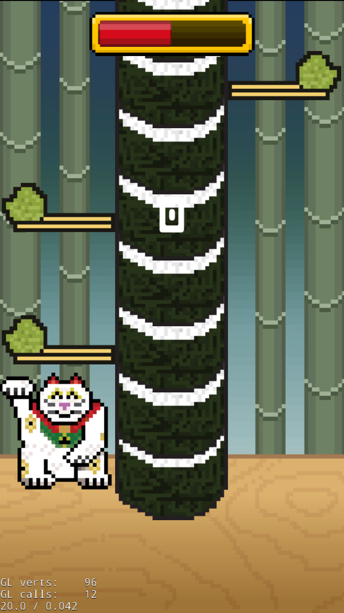

Move the Sushi Tower
====================

Our next goal is to get the sushi tower to move downward with each of the player's taps. Once we get that working we'll be able to add in collision detection!

Early we mentioned that we want the tower to cycle between the ten pieces we have already created. 

To do this, you'll first need to create a new instance variable in `MainScene`. Call it `pieceIndex`. This will be an `int` that tracks which piece in the `pieces` vector is at the bottom of the tower.  Make sure you initialize it to `0` in `MainScene::init()`.

We want to create a `stepTower` method in the `MainScene` class that does the following:

1. Grab a pointer to the `currentPiece` from the `pieces` array.
2. Move `currentPiece` to top of tower
3. Increase its *z-order* by one
4. Randomize its obstacle
5. Moves `piecesNode` down by the height of a piece
6. Increment `pieceIndex`

We'll add more to the `stepTower` method later on but go ahead and give this version a shot.

> [info]
> Here's some tips: 
> After you make the `pieceIndex` instance variable, you can access the current piece with `this->pieces.at(this->pieceIndex)`.
> 
> You will want to use the `Piece` method `getSpriteHeight()` as part of your calculations both for how much to move the `currentPiece` to get it to the top of the tower, and also for how much to move `piecesNode` down. Make sure that whenever you use `getSpriteHeight()` you divide the result by `2.0f` because we want the roll sprites be covering each other.
> 
> Z-order is a number representing the order that sprites should be drawn to the screen.  Objects with z-orders that are higher are drawn later, so they will cover up sprites with lower z-orders that have already been drawn. When manipulating the *z-order* of the `currentPiece`, use the `getLocalZOrder` and `setLocalZorder` methods.
> 
> While incrementing `pieceIndex`, remember that index values >= 10 will be out of bounds of the `pieces` vector.

> [solution]
> You should have added a method that looks something like this to the `MainScene` class:
>
	void MainScene::stepTower()
	{
	    // get a reference to the lowest piece
	    Piece* currentPiece = this->pieces.at(this->pieceIndex);
>
	    // move the lowest piece to the top of the tower
	    currentPiece->setPosition(currentPiece->getPosition() + Vec2(0.0f, currentPiece->getSpriteHeight() / 2.0f * 10.0f));
>	    
	    // set the zOrder of the piece so that it appears on top of the others
	    currentPiece->setLocalZOrder(currentPiece->getLocalZOrder() + 1);
>	    
	    // set the side of the obstacle, based on the side of the obstacle of the piece right before this one
	    currentPiece->setObstacleSide(this->getSideForObstacle(this->lastObstacleSide));
	    this->lastObstacleSide = currentPiece->getObstacleSide();
>	    
	    // move pieceNode down so that the whole tower moves down
	    this->pieceNode->setPosition(this->pieceNode->getPosition() + Vec2(0.0f, -1.0f * currentPiece->getSpriteHeight() / 2.0f));
>	    
	    // change the index referencing the lowest piece
	    this->pieceIndex = (this->pieceIndex + 1) % 10;
	}
It's okay it's not exact, as long as it works the same way!

Now, inside the `onTouchBegan` lambda expression in `MainScene::setupTouchHandling()`, right before `return true`, call `this->stepTower()` to use our newly created step tower method.

Launch the game and play around a bit. You should have an infinitely looping tower of sushi with randomized obstacles!

<!-- TODO: Uncomment when done editing P4

<video>
	<source src="https://s3.amazonaws.com/mgwu-misc/Sushi+Neko+Cpp/towerStep.mov" type="video/mp4">
</video>

-->

**Detect Collisions and Trigger Game Over**

We already have a variable storing a `Side` in the `Piece` class but we need one in character before we get started. Add a `side` variable to the `Character` class. Also update the `left()` and `right()` methods accordingly.

> [solution]
> Your `Character` class should now look like this:
>
>       var side: Side = .Left
>
>       func left() {
>           side = .Left
>           scaleX = 1
>       }
>
>       func right() {
>           side = .Right
>           scaleX = -1
>       }

Now checking for collisions between the character and obstacles is as easy as comparing their `side` properties!

> [action]
> Add a `gameOver` instance variable to `MainScene` and complete the code connection to `restartButton`:
>
>       var gameOver = false
>       var restartButton: CCButton!
>
> Create a `isGameOver() -> Bool ` method in `MainScene`:
>
>       func isGameOver() -> Bool {
>           var newPiece = pieces[pieceIndex]
>
>           if newPiece.side == character.side { triggerGameOver() }
>
>           return gameOver
>       }
>
> Also create `triggerGameOver()` in `MainScene`:
>
>       func triggerGameOver() {
>           gameOver = true
>           restartButton.visible = true
>       }

The last step is to call `isGameOver()` at the appropriate times. Once a game over is triggered, the restart button will appear!

There are three types of collisions that trigger a game over in Timberman:

1. switch into - player switched into base obstacle
2. head-on - player continued into next obstacle
3. switch into, head-on - player switched into next obstacle

We can catch the first one by checking right after moving the character (in `touchBegan`) and we can catch the others by checking right after the tower is stepped (in `stepTower`).

> [action]
> Add the line below to `touchBegan` right before `stepTower` is called:
>
>       if isGameOver() { return }
>
> Also add it at the end of `stepTower`.

Try out the game now. You'll realize that a restart button appears, but you can still continue to play and the restart button doesn't actually work.

> [action]
> Add the following line to the beginning of `touchBegan`:
>
>       if gameOver { return }
>
> We also need to define the `restart()` method for `restartButton`.
>
>       func restart() {
>           var scene = CCBReader.loadAsScene("MainScene")
>           CCDirector.sharedDirector().replaceScene(scene)
>       }

Now that we short-circuit out of `touchBegan` after a game over, the player can no longer continue playing after a collision. `restart()` has also been defined so we can try again after losing.

The core gameplay is pretty close to completion. The only thing left is the timer and score!

**Get the Timer Working**

In Timberman there is a timer constantly counting down. Every successful move adds a little bit of time. You'll trigger a game over for running out of time if you don't play fast enough.

We are going to use property observers to update the `scaleX` of our `lifeBar` and an `update()` loop to decrement it.

> [action]
> First we need to complete the code connection for `lifeBar`. Add the following to `MainScene` near your instance variables:
>
>       var lifeBar: CCSprite!
>
> We also want to create an instance variable to track time left and setup a property observer on it to change `scaleX` on `lifeBar` whenever it changes. Add the following near your other instance variables:
>
>       var timeLeft: Float = 5 {
>           didSet {
>               timeLeft = max(min(timeLeft, 10), 0)
>               lifeBar.scaleX = timeLeft / Float(10)
>           }
>       }

The `didSet` property observer for `timeLeft` clamps the time between 0 and 10. After that, it sets the `scaleX` of `lifeBar` as a percentage of time left divided by 10 (the maximum amount of buffer the player can build).

> [action]
> Add the following to the end of `stepTower()`:
>
>       timeLeft = timeLeft + 0.25
>
> And add an `update` loop to decrement `timeLeft` and trigger game over if the player runs out of time:
>
>       override func update(delta: CCTime) {
>           if gameOver { return }
>           timeLeft -= Float(delta)
>           if timeLeft == 0 {
>               triggerGameOver()
>           }
>       }

> [info]
> It's safe to check if `timeLeft` is equal to zero since we clamped it in the `didSet` property observer.

The only thing left to do in core gameplay is implementing the score!

**Update the Score**

The score implementation is pretty similar the timer. We'll complete the `scoreLabel` code connection. Then we'll set up an instance variable with a `didSet` property observer to track the score and update the `scoreLabel`. Finally, we'll increment `score` at the end of `stepTower`.

Try and see if you can implement it on your own!

> [solution]
> Add the following to complete the code connection for `scoreLabel`:
>
>       var scoreLabel: CCLabelTTF!
>
> Create a `score` instance variable with a `didSet` property observer to update `scoreLabel`:
>
>       var score: Int = 0 {
>           didSet {
>               scoreLabel.string = "\(score)"
>           }
>       }
>
> Increment score at the end of `touchBegan`:
>
>       score++

Congrats! You have completed the core gameplay for Sushi Neko, a Timberman clone! Continue onto part two to polish up the gameplay :)

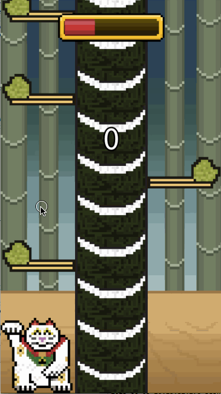
