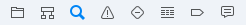
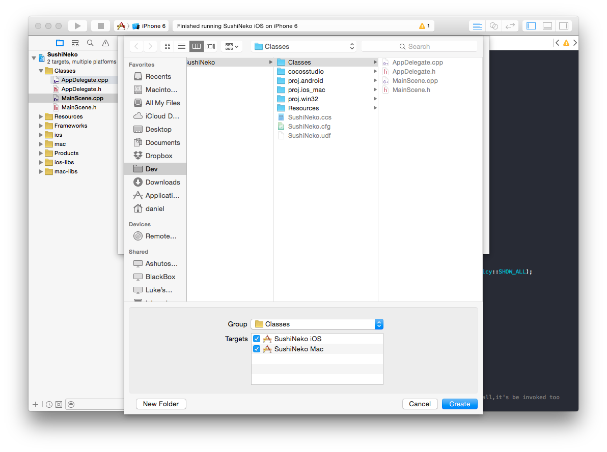

Time to code! In this step we are going to hook up the UI we've created in Cocos Studio with the game logic we're going to code in Xcode.

> [action]
Open your Xcode project if it isn't already. 

Your Xcode project is contained inside the *proj.ios_mac* sub-directory in the directory where your Cocos Studio project lives. If you don't remember where you saved it, search for your project name *SushiNeko.xcodeproj* in Spotlight (magnifying glass at the top right of your Mac's screen).

First we're going to make some changes to the generated template code to make the game work on any device resolution.

Modify AppDelegate.cpp
======================

First we will modify our AppDelegate class.  The AppDelegate is the class that handles interfacing with the operating system.  For example, `void AppDelegate::applicationDidEnterBackground() ` is called every time your game is backgrounded.

We're going to modify `bool AppDelegate::applicationDidFinishLaunching()`. This method is called the first time your game is loaded, and is where most of our game-specific Cocos2d-x setup occurs. 

> [action]
Change this line:
>
	director->getOpenGLView()->setDesignResolutionSize(640, 960, ResolutionPolicy::SHOW_ALL);
>	
to look like this:
>
	glview->setDesignResolutionSize(640, 960, ResolutionPolicy::FIXED_WIDTH);
	
This will make sure that the game won't be letterboxed (black bars appearing on the top and bottom) for the various iPhone resolutions. Notice that the design resolution here is the same as what we have set in Cocos Studio!

Now we'll add in the code that will tell Cocos2d-x where to look for assets for various screen resolutions.

Below this line:

	FileUtils::getInstance()->addSearchPath("res"); 
	
Add the following:

	std::vector<std::string> searchResolutionsOrder(1);
    
    cocos2d::Size targetSize = glview->getFrameSize();
    
    if (targetSize.height < 481.0f)
    {
        searchResolutionsOrder[0] = "resources-1x";
    }
    else if (targetSize.height < 1137.0f)
    {
        searchResolutionsOrder[0] = "resources-2x";
    }
    else if (targetSize.height < 2047.0f)
    {
        searchResolutionsOrder[0] = "resources-3x";
    }
    else
    {
        searchResolutionsOrder[0] = "resources-4x";
    }
    
    FileUtils::getInstance()->setSearchResolutionsOrder(searchResolutionsOrder);

This code tells Cocos2d-x to use different assets depending on the pixel height of the display.  For example, if the height is between 1137 and 2047 pixels, it will load images from the *resources-3x* directory.

Modify HelloWorldScene.cpp
==========================

Because of a bug in Cocos2d-x (specifically the code that reads our Cocos Studio files), we have to add a bit of code to ensure that the positions of our objects that we created in Cocos Studio are correctly repositioned for various resolutions.

> [action]
In *HelloWorldScene.cpp*, right below this line: `auto rootNode = CSLoader::createNode("MainScene.csb");`
>
Add the following:
>
    Size size = Director::getInstance()->getVisibleSize();
    rootNode->setContentSize(size);
    ui::Helper::doLayout(rootNode);
    
In general, these lines will have to be added after loading any new scene from a *.csb* file until the bug is fixed!

Press the play button to see the UI of your game in the iOS simulator! 

It should look something like this:

Rename HelloWorldScene
=====================

Unfortunately, the default Cocos Studio new project template gives the main scene the name `HelloWorldScene`. Because it's a good practice to give classes names that describe their function, we're going to rename `HelloWorldScene` to `MainScene`. Also that way the scene in Cocos Studio, *MainScene.csd*, matches the scene in code. This is a good opportunity to learn about Xcode's project search feature.

Click the third tab on Xcode's left panel. 

Search for *HelloWorldScene*. You should find two results. 

Change the search from *Find > Text > Containing* to *Replace > Text > Containing*.  

Use the *Replace All* button to replace the instances of *HelloWorldScene* with *MainScene*. 

Xcode may ask you if you want to take a snapshot before performing the operation. You should *disable* snapshotting - it's a form of version control, but not a very good one. Instead consider using [git.](https://git-scm.com/).

Now do the same thing, except replace all instances of *HelloWorld* with *MainScene*. 

Generally speaking, you should be very careful using replace all functionality in text editors - it's very easy to unintentionally replace something that you didn't intend to. It's a better practice to check each result individually and use the *Replace* button to replace one at a time, instead of doing all of them with *Replace All*. However, for the purposes of this tutorial, doing a *Replace All* was okay.

Finally, rename *HelloWorldScene.h* and *HelloWorldScene.cpp* to *MainScene.h* and *MainScene.cpp*.  It's easy to rename files in Xcode, just click the file, hit the enter key, then type the name.

You will likely often find yourself using Xcode's Find feature - it's a very fast way to look for a piece of code.

Set Up Custom Classes in Cocos Studio
=====================================

Now let's go back to our Cocos Studio project. We're going to create *Custom Class* linkages for the Character and Piece objects we made.  This will allow us to define custom behaviors for those objects in code.  We didn't do this step earlier because setting a custom class in Cocos Studio will cause the game to crash when its run if the custom classes are not also defined in code.

Open *Character.csd*.  Click the root (topmost) node in the timeline.  It's called Node.  Then, in the *Properties* panel on the right, click the *Advanced* tab.  Set the *Custom Class* to Character.

It looks like this:

Now do the exact same steps for *Piece.csd* - set its custom class to Piece.

**Save and publish the Cocos Studio project before moving on!**

Create Some Classes
===================

Now we'll create the code for the custom classes we just set up in Cocos Studio. We'll need four new classes for our game right now:

1. `Character`
2. `CharacterReader`
3. `Piece`
4. `PieceReader`

In Xcode, go to *File > New > File*. Select *C++ File*.  Name it *Character*.

Save it in your *Classes* folder. Check the box labeled SushiNeko Mac so that this file is available in both the iOS and Mac targets.

Define the `Character` class as a subclass of `Node` in *Character.h*.

	#ifndef __SushiNeko__Character__
	#define __SushiNeko__Character__

	#include "cocos2d.h"

	class Character : public cocos2d::Node
	{
	public:
	    CREATE_FUNC(Character);
	    
	protected:
	    
	};
	
	#endif /* defined(__SushiNeko__Character__) */

Now let's create the CharacterReader class.  Whenver we create an object in Cocos Studio and give it custom behaviors by linking it to a custom class, we have to create a corresponding Reader class to load and link the Cocos Studio object with its associated code. Create a new C++ file called *CharacterReader*. 

Add the following code in-between the header guards of *CharacterReader.h*

	#include "cocos2d.h"
	#include "cocostudio/WidgetReader/NodeReader/NodeReader.h"

	class CharacterReader : public cocostudio::NodeReader
	{
	public:
	    static CharacterReader* getInstance();
	    static void purge();
	    cocos2d::Node* createNodeWithFlatBuffers(const flatbuffers::Table* nodeOptions);
	};

Then in *CharacterReader.cpp*, add the following:

	#include "CharacterReader.h"
	#include "Character.h"

	using namespace cocos2d;

	static CharacterReader* _instanceCharacterReader = nullptr;

	CharacterReader* CharacterReader::getInstance()
	{
	    if (!_instanceCharacterReader)
	    {
	        _instanceCharacterReader = new CharacterReader();
	    }
	    return _instanceCharacterReader;
	}

	void CharacterReader::purge()
	{
	    CC_SAFE_DELETE(_instanceCharacterReader);
	}

	Node* CharacterReader::createNodeWithFlatBuffers(const flatbuffers::Table *nodeOptions)
	{
	    Character* node = Character::create();
	    setPropsWithFlatBuffers(node, nodeOptions);
	    return node;
	}

This is all boilerplate code required by Cocos2d-x to read Cocos Studio objects.  The code will be the same for every reader class, except you will replace all instances of `CharacterReader` with `YourClassReader` and `Character` with `YourClass`.  Because the code is the same and you won't really interact with it much, it's not super important to understand it.  But if you're interested, here's some additional information:

> [info]
> CharacterReader is a singleton, which means that (when used correctly) there will only ever be a single instance of it.  The line 
> 
> 	`static CharacterReader* _instanceCharacterReader = nullptr;`
> 
> Together with the implementation of `CharacterReader::getInstance()` are the canonical way to create singletons in Cocos2d-x projects. When interacting with singletons, instead of creating new objects with `new` or `create()`, instead you always retrieve the single instance with `getInstance()` and interact with that.
> 
> Purge is called by Cocos2d-x when the reader is no longer needed, to delete it.
> 
> `createNodeWithFlatBuffers` is what's called by the Cocos2d-x code to create and initialize the object with the properties set in Cocos Studio. 

**Follow the same steps to create the `Piece` and `PieceReader` classes.**

After you've done that, we have to tell Cocos2d-x where to find the reader classes.  Open *MainScene.cpp* and below these lines in `init`:

    if ( !Layer::init() )
    {
        return false;
    }

Add the following:

    // Register the readers for our custom classes
    // Be very careful to do CharacterReader::getInstance, not CharacterReader::getInstance() which will crash
    CSLoader* instance = CSLoader::getInstance();
    instance->registReaderObject("CharacterReader", (ObjectFactory::Instance) CharacterReader::getInstance);
    instance->registReaderObject("PieceReader", (ObjectFactory::Instance) PieceReader::getInstance);

You'll notice that the compiler complains, it will say something like "Use of undeclared identifier 'CharacterReader'".  That's because we haven't yet told the compiler about our `CharacterReader` and `PieceReader` classes.  To do that, add the following to the other `#includes` commands:

	#include "CharacterReader.h"
	#include "PieceReader.h"

Try running again.  It might look the same

What's Next
===========

We'll be building the game's code piece by piece. Our plan is to:

1. Build the sushi tower of obstacles
2. Add touch controls to move the character
3. Randomize the obstacle side
4. Move down the sushi tower with every touch
5. Detect collisions & trigger a game over
6. Get the timer working
7. Update the score

**Building the Sushi Tower**

We'll build the sushi tower up in the `didLoadFromCCB` method so that it's added before `MainScene` is shown to the player.

Our goal is to create a tower ten pieces high. When we start moving that tower down, we'll actually move the bottom piece back to the top of the tower instead of removing it from the scene. This will save a bit of processing power since we are reusing the same objects.

Start off by defining `didLoadFromCCB`.

> [solution]
> It should look like:
>
>       func didLoadFromCCB() {
>
>       }

We'll also need access to one of those code connections we added in SpriteBuilder. Add an instance variable to `MainScene` for `piecesNode`. You should also create an empty Piece array called `pieces`.

> [solution]
> After the opening curly brace in `class MainScene: CCNode {` add:
>
>       var piecesNode: CCNode!
>       var pieces: [Piece] = []
>
> Remember, we always use *implicitly unwrapped optionals* (the !) for code connections from SpriteBuilder.

Inside the `didLoadFromCCB` method, load in ten instances of `Piece.ccb` and position them so they build up a tower. Add each piece as a child of `piecesNode` and use the `contentSizeInPoints` of the piece to calculate the offset in its y-position. Ten instances of `Piece.ccb` should be enough to cover the screen of any device you build on.

Give it a shot then run the project to see if your solution worked.

> [solution]
> One possible way to write `didLoadFromCCB` is:
>
>       for i in 0..<10 {
>           var piece: Piece = CCBReader.load("Piece") as! Piece
>
>           var yPos = piece.contentSizeInPoints.height * CGFloat(i)
>           piece.position = CGPoint(x: 0, y: yPos)
>           piecesNode.addChild(piece)
>           pieces.append(piece)
>       }
>
> In each iteration of the for-loop we load in a new `Piece` from `Piece.ccb`. We then set its x-position to 0 and y-position is set to the iteration number multiplied by `piece.contentSizeInPoints`.
>
> Remember how we manually changed the anchor point and content size of the root node in `Piece.ccb`? Now you may be able to see how those values are making our life a whole lot easier on the code side. The lowest piece is added as a child of `piecesNode` with a position of `(0, 0)` and its exactly where we want it. Each subsequent piece is offset appropriately in the y-direction so they line up into a nice tower.
>
> If your solution is different, make sure it matches the requirements above.

Your game should now look like this when you run it:

Once you have it working, move onto adding touch controls.

**Add Touch Controls**

To add touch controls we first need a method we can call to move the `Character` to the right side of the screen and back. We'll be relying on a little trick to make this easy -- setting the `scaleX` to -1 flips a sprite horizontally around its anchor point. Since `Character` already has an anchor point at the center of the screen, we can us this trick to flip it to the other side.

Your job is to create two methods in Character.swift:

1. `left` - move the character to the left side of the screen
2. `right` - move the character to the right side of the screen

We'll trigger these methods from `MainScene` when we add in the touch controls.

> [solution]
> You should have added the following methods to the `Character` class:
>
>       func left() {
>           scaleX = 1
>       }
>
>       func right() {
>           scaleX = -1
>       }

Before we can actually detect touches, we need to complete the code connection for `character` and set `userInteractionEnabled` in the `MainScene` class.

> [action]
> Add this near where you declared the other instance variables:
>       var character: Character!
>
> Add this to the end of `didLoadFromCCB` in `MainScene.swift`:
>
>       userInteractionEnabled = true

Now we can override `touchBegan` and add in our code.

> [action]
> Create and empty `touchBegan` method in `MainScene.swift`:
>
>       override func touchBegan(touch: CCTouch!, withEvent event: CCTouchEvent!) {
>
>       }

Inside `touchBegan`, try using `touch.locationInWorld().x` and `CCDirector.sharedDirector().viewSize().width` to determine which side of the screen a touch is on. Call `character.left()` and `character.right()` to trigger the correct movements.

> [solution]
> The `touchBegan` method should look like:
>
>       var xTouch = touch.locationInWorld().x
>       var screenHalf = CCDirector.sharedDirector().viewSize().width / 2
>       if xTouch < screenHalf {
>           character.left()
>       } else {
>           character.right()
>       }

You should now be able to move the character from one side to another and back:

**Randomize Each Obstacle's Side**

Before we start randomizing the obstacle side, we should declare an enum to add uniformity to checking sides in code.

> [action]
> At the top of `MainScene.swift` (before the class declaration) add:
>
>       enum Side {
>           case Left, Right, None
>       }

Now we can refer to the type `Side` with three different values: Left, Right, and None. This will make our lives a lot easier throughout our code.

Let's setup the `Piece` class. We need to complete the code connections to `left` and `right` (our chopstick sprites from SpriteBuilder) and add a `side` variable to keep track of which obstacle is showing. We want this variable to trigger the correct visibility of `left` and `right` each time it changes.

> [action]
> Open up `Piece.swift` and add this to the top of the class declaration:
>
>       var left: CCSprite!
>       var right: CCSprite!
>
>       var side: Side = .None {
>           didSet {
>               left.visible = false
>               right.visible = false
>               if side == .Right {
>                   right.visible = true
>               } else if side == .Left {
>                   left.visible = true
>               }
>           }
>       }

> [info]
> The `didSet` property observer gets called each time the `side` variable is set. This allows us to trigger the correct visibility of `left` and `right`.

We want our obstacles (chopsticks) to randomly choose a side but we need to have a few rules to make sure the game is fair and we do not produce an impossible to pass sequence. Our rules for obstacle generation are:

1. a piece has no obstacle if the previous piece had one
2. right should appear 45% of the time an obstacle can be added
3. left should appear 45% of the time an obstacle can be added
4. no obstacle should appear 10% of the time an obstacle can be added

To make sure our pieces follow these rules, we'll pass in the obstacle side of the previous piece every time we randomize a piece. Time to implement the rules!

> [action]
> Create a method in the `Piece` class as follows:
>
>       func setObstacle(lastSide: Side) -> Side {
>
>       }

Now fill it in according to our four rules. Remember to return the side that is randomly chosen.

> [info]
> You can call `CC_RANDOM_0_1()` to randomly generate a number between 0 and 1.

> [solution]
> The body of `setObstacle` should look like:
>
>       if lastSide != .None {
>           side = .None
>       } else {
>           var rand = CCRANDOM_0_1()
>           if rand < 0.45 {
>               side = .Left
>           } else if rand < 0.9 {
>               side = .Right
>           } else {
>               side = .None
>           }
>       }
>       return side

The `Piece` class is all ready so let's go back to `MainScene.swift`. We need an instance variable `lastPieceSide` to keep track of the last piece's side. This will be especially important when we start moving the sushi tower down with each tap.

> [action]
> Add this near your other instance variables in `MainScene`:
>
>       var pieceLastSide: Side = .Left

We're setting `pieceLastSide` to `Left` so that the bottom piece always has a side of `None`.

> [action]
> Add this below the line with `var piece: Piece = CCBReader.load("Piece") as! Piece` in `didLoadFromCCB`:
>
>       pieceLastSide = piece.setObstacle(pieceLastSide)

This line is pretty powerful. It both randomizes the current piece's obstacle side and updates `pieceLastSide` since we return the chosen side.

Run the game. It should have randomized obstacles now!

**Move the Sushi Tower**

Our next goal is to get the sushi tower to move downward with each of the player's taps. Once we get that working we'll be able to add in collision detection!

Early we mentioned that we want the tower to cycle between the ten pieces we have already created. We want to create a `stepTower` method in the `MainScene` class that does the following:

1. moves current piece to top of tower
2. increase its `zOrder` by one
3. randomize its obstacle
4. moves `piecesNode` down by the content size of a piece

We'll add more to the `stepTower` method later on but go ahead and give this version a shot. Remember that you have a `pieces` array. You'll probably want to also create a new index variable, `pieceIndex`, to track the index of the current piece in `pieces`.

> [info]
> Do not rely on `piecesNode.children`. The order of this array is not guaranteed. It is currently optimized for drawing the contents to the screen but could change in the future.

> [solution]
> You should have added a method like this to the `MainScene` class:
>
>       func stepTower() {
>           var piece = pieces[pieceIndex]
>
>           var yDiff = piece.contentSize.height * 10
>           piece.position = ccpAdd(piece.position, CGPoint(x: 0, y: yDiff))
>
>           piece.zOrder = piece.zOrder + 1
>
>           pieceLastSide = piece.setObstacle(pieceLastSide)
>
>           piecesNode.position = ccpSub(piecesNode.position,
>                                        CGPoint(x: 0, y: piece.contentSize.height))
>
>           pieceIndex = (pieceIndex + 1) % 10
>       }
>
> You might have noticed that `pieceIndex` hasn't be declared yet. Make sure to add the following near your other instance variables:
>
>       var pieceIndex: Int = 0

Launch the game and play around a bit. You should have an infinitely looping tower of sushi with randomized obstacles!

**Detect Collisions and Trigger Game Over**

We already have a variable storing a `Side` in the `Piece` class but we need one in character before we get started. Add a `side` variable to the `Character` class. Also update the `left()` and `right()` methods accordingly.

> [solution]
> Your `Character` class should now look like this:
>
>       var side: Side = .Left
>
>       func left() {
>           side = .Left
>           scaleX = 1
>       }
>
>       func right() {
>           side = .Right
>           scaleX = -1
>       }

Now checking for collisions between the character and obstacles is as easy as comparing their `side` properties!

> [action]
> Add a `gameOver` instance variable to `MainScene` and complete the code connection to `restartButton`:
>
>       var gameOver = false
>       var restartButton: CCButton!
>
> Create a `isGameOver() -> Bool ` method in `MainScene`:
>
>       func isGameOver() -> Bool {
>           var newPiece = pieces[pieceIndex]
>
>           if newPiece.side == character.side { triggerGameOver() }
>
>           return gameOver
>       }
>
> Also create `triggerGameOver()` in `MainScene`:
>
>       func triggerGameOver() {
>           gameOver = true
>           restartButton.visible = true
>       }

The last step is to call `isGameOver()` at the appropriate times. Once a game over is triggered, the restart button will appear!

There are three types of collisions that trigger a game over in Timberman:

1. switch into - player switched into base obstacle
2. head-on - player continued into next obstacle
3. switch into, head-on - player switched into next obstacle

We can catch the first one by checking right after moving the character (in `touchBegan`) and we can catch the others by checking right after the tower is stepped (in `stepTower`).

> [action]
> Add the line below to `touchBegan` right before `stepTower` is called:
>
>       if isGameOver() { return }
>
> Also add it at the end of `stepTower`.

Try out the game now. You'll realize that a restart button appears, but you can still continue to play and the restart button doesn't actually work.

> [action]
> Add the following line to the beginning of `touchBegan`:
>
>       if gameOver { return }
>
> We also need to define the `restart()` method for `restartButton`.
>
>       func restart() {
>           var scene = CCBReader.loadAsScene("MainScene")
>           CCDirector.sharedDirector().replaceScene(scene)
>       }

Now that we short-circuit out of `touchBegan` after a game over, the player can no longer continue playing after a collision. `restart()` has also been defined so we can try again after losing.

The core gameplay is pretty close to completion. The only thing left is the timer and score!

**Get the Timer Working**

In Timberman there is a timer constantly counting down. Every successful move adds a little bit of time. You'll trigger a game over for running out of time if you don't play fast enough.

We are going to use property observers to update the `scaleX` of our `lifeBar` and an `update()` loop to decrement it.

> [action]
> First we need to complete the code connection for `lifeBar`. Add the following to `MainScene` near your instance variables:
>
>       var lifeBar: CCSprite!
>
> We also want to create an instance variable to track time left and setup a property observer on it to change `scaleX` on `lifeBar` whenever it changes. Add the following near your other instance variables:
>
>       var timeLeft: Float = 5 {
>           didSet {
>               timeLeft = max(min(timeLeft, 10), 0)
>               lifeBar.scaleX = timeLeft / Float(10)
>           }
>       }

The `didSet` property observer for `timeLeft` clamps the time between 0 and 10. After that, it sets the `scaleX` of `lifeBar` as a percentage of time left divided by 10 (the maximum amount of buffer the player can build).

> [action]
> Add the following to the end of `stepTower()`:
>
>       timeLeft = timeLeft + 0.25
>
> And add an `update` loop to decrement `timeLeft` and trigger game over if the player runs out of time:
>
>       override func update(delta: CCTime) {
>           if gameOver { return }
>           timeLeft -= Float(delta)
>           if timeLeft == 0 {
>               triggerGameOver()
>           }
>       }

> [info]
> It's safe to check if `timeLeft` is equal to zero since we clamped it in the `didSet` property observer.

The only thing left to do in core gameplay is implementing the score!

**Update the Score**

The score implementation is pretty similar the timer. We'll complete the `scoreLabel` code connection. Then we'll set up an instance variable with a `didSet` property observer to track the score and update the `scoreLabel`. Finally, we'll increment `score` at the end of `stepTower`.

Try and see if you can implement it on your own!

> [solution]
> Add the following to complete the code connection for `scoreLabel`:
>
>       var scoreLabel: CCLabelTTF!
>
> Create a `score` instance variable with a `didSet` property observer to update `scoreLabel`:
>
>       var score: Int = 0 {
>           didSet {
>               scoreLabel.string = "\(score)"
>           }
>       }
>
> Increment score at the end of `touchBegan`:
>
>       score++

Congrats! You have completed the core gameplay for Sushi Neko, a Timberman clone! Continue onto part two to polish up the gameplay :)

