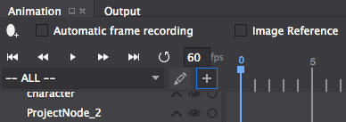
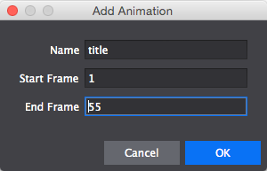
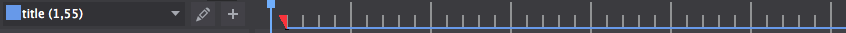
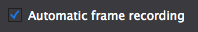
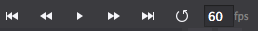
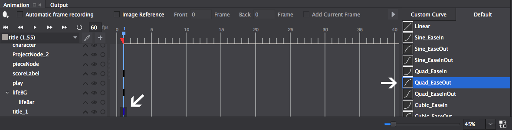
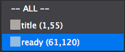

---
title: "Adding a title screen"
slug: title-screen
---     

Polishing the Gameplay
======================

Now it's time to start turning this into a fully polished game. In this section we will:

1. Add a title screen with animation
2. Add a ready to play animation
3. Add tap indicators

Adding a Title Screen
=====================

##Adding a title

Now let's build a title for our game. Open *MainScene.csd* in your Cocos Studio project. 

> [action]
> 
From *Assets/Images/resources-2x*, drag *title.png* on to the scene.
Set its:
> 
> - *anchor point* to `(0.5, 1)`
> - *position* to `(50%, 140%)`
> - *visiblity* toggle to off

You'll notice that not only did we set the title image way off the top of the screen, we also made it invisible. That's because we're about to add an animation that will drop it into view!

##Animating the title

First, let's set up our animation timeline. Click the *add animation* button to make one. It's the button highlighted in blue in the following image:

> [action]
> 
In the dialog box that pops up, set the:
>
> - *Name* to title
> - *Start Frame* to 1
> - *End Frame* to 55

Now you will have a newly created animation timeline with an associated color. Cocos Studio will draw a line with that color over the frames that are part of this timeline.

Check the *Automatic frame recording* checkbox.

With *automatic frame recording* enabled, whenever you change an object's property in the properties panel on the right, it will change that property on the frame the scrub bar is on, as part of an animation.

Drag the blue scrubber bar over to frame 1, and click the title sprite in the timeline. Check the *visibility* property.

You should see the title appear at the top of the screen, and you should also see a new keyframe created at the interesection of the scrubber and the title timeline track. The keyframe is indicated as a small black rectange in the animation editor window.

Now drag the scrubber over to frame 50. Set the title sprite position to (50%, 80%).

Now drag the scrubber back to frame 1, and set the title sprite position to (50%, 140%).

Try dragging the scrubber around - you will see the title sprite moving between the two positions set in frame 1 and frame 50. Try playing it by clicking the play button:

The animation will loop, which can sometimes be annoying. To disable looping, click the circular arrow.

> [info]
> 
> Despite the fact that we only defined the position of the title sprite for frames 1 and 50, we still get continuous motion and movement for each frame between. The animation is automatically interpolated for us, a process often called *tweening*. This is a very powerful property of key frame animation - sophisticated results can be achieved with relatively little work.

Set the scrubber to frame 1, and toggle the *visibility* to off for both the scoreLabel and lifeBG. This way they aren't distracting from the animating title.

This is what your animation should look like:

<video width="100%" controls>
	<source src="https://s3.amazonaws.com/mgwu-misc/Sushi+Neko+Cpp/titleLinear.mov" type="video/mp4">
</video>

The title animation looks good, but it could look better. Click keyframe 1 in the title row. Then, on the right, click the *Quad_EaseOut* curve

Now try playing the animation. You'll notice that the title starts out dropping faster, but then decelerates as it approaches its final position, which makes it look like it has more weight and is just more interesting in general.

> [info]
> 
> Custom *tween ease curves* like the one we just used are another important and powerful property of key frame animation. By default, tweened animations follow a *linear* curve. That is, that as an animated property is changing from its initial value to its final one, it will change the same amount each frame. Easing curves allow us to accelerate and deccelerate the change at various points in the animation. Eased animations look more natural - objects in real life can't accelerate and deccelerate instantly, they require time to get up to speed. Try experimenting with different curves for the title. If you find one you like better than *Quad_EaseOut*, feel free to use that one instead.

Your final title animation should look like this:

<video width="100%" controls>
	<source src="https://s3.amazonaws.com/mgwu-misc/Sushi+Neko+Cpp/titleEase.mov" type="video/mp4">
</video>

Add Ready Animations
====================

After the title screen, we're going to have another game state - the *ready* state. In this state, the title sprite disappears and the life bar appears, which will provide a smooth transition into the playing state. It will also act as a sort of simple tutorial - we will add animated tap sprites that teach the user how to play.

##Adding the tap sprites

We need to get our tap sprites on the screen before we can animate them.

Make sure to **uncheck** *Automatic frame recording* before doing the following:

> [action] 
> Drag *tap_left.png* in to the scene. Change the following properties:
> 
> - *Name* to tapLeft.
> - *Anchor Point* to (0.0, 0.5)
> - *Position* to (10%, 8.75%)

> [action] 
> Drag *tap_right.png* in to the scene. Change the following properties:
> 
> - *Name* to tapRight.
> - *Anchor Point* to (1.0, 0.5)
> - *Position* to (90%, 8.75%)
 
If you run the *title* animation again, you shall see that now the tap sprites are hanging out the bottom of the screen, distracting from the title. 

**Check** *Automatic frame recording* again, and move the scrubber to frame 1. Toggle the *visiblity* of both tapLeft and tapRight to off, so that they are not visible during the title animation.

##Creating a New Animation

> [action]
> Use the same *Add Animation* button as before to create a new animation, with these properties:
>
> - *Name*: ready
> - *Start Frame*: 61
> - *End Frame*: 120

##Animating the Indicators

Move the scrubber to frame 61. Uncheck the visibility for the title sprite, so that it becomes invivisble at the start of the ready animation.

Also make tapLeft, tapRight and lifeBG become visible at frame 61.

Let's get started with our animation. We want the tap buttons to move back and forth from left to right so they catch the player's attention.

Move the scrubber to frame 90. Change the position of tapLeft to (0%, 8.75%) and tapRight to (100%, 8.75%).

Because of the way Cocos Studio works, that will actually have changed the position of the tapLeft and tapRight sprites for all frames. To fix that, move the scrubber back to frame 61, and change the positions for tapLeft and tapRight back to what they were:

tapLeft - (10%, 8.75%)
tapRight - (90%, 8.75%)

Move the scrubber to frame 120 and set tapLeft and tapRight to the exact same positions as in frame 61.

In the animation dropdown, set the active animation to ready.

Try playing it. We're going to make it loop it in-game, so to see how it looks like looped, click the same button you used to deactivate looping.

It should look like this:

<video width="100%" controls>
	<source src="https://s3.amazonaws.com/mgwu-misc/Sushi+Neko+Cpp/readyAnimation.mov" type="video/mp4">
</video>

Coding the Transitions
======================

Now that we have everything set up in Cocos Studio, **save and publish** your project to Xcode so we can add the code needed to get these changes working.

##Game state

We first want to reconsider the way we track game state. Right now we only have two states: `Playing` and `GameOver`. With the two new animations we just added, we'll probably want a few more:

> [action]
> In *MainScene.h*, modify `GameState` to look like this:
> 
	enum class GameState
	{
	    Title,
	    Ready,
	    Playing,
	    GameOver
	};
>

We're about to modify the game so that it starts on the title screen.

> So, in `MainScene::init()`, change the line:
> 
	this->gameState = GameState::Playing;
> 
> to:
> 
    this->gameState = GameState::Title;
> 

So that our initial value for `gameState` is correct.

##Run the Title Animation

> [action]
> 
> Declare a new method in *MainScene.h* called `triggerTitle()`. In *MainScene.cpp* add the following:
> 
	void MainScene::triggerTitle()
	{
	    this->gameState = GameState::Title;
	}
	
This will behave very similarly to `triggerPlaying()` and `triggerGameOver()`. At this point it just changes the `gameState` variable - let's add the code necessary to play our animation:

    cocostudio::timeline::ActionTimeline* titleTimeline = CSLoader::createTimeline("MainScene.csb");
    this->stopAllActions();
    this->runAction(titleTimeline);
    titleTimeline->play("title", false);
    
First we create an `ActionTimeline` object named `titleTimeline`. Notice that we pass `"MainScene.csb"` to the constructor - this `ActionTimeline` will be able to play any of the animations that we've created in *MainScene.csd*. 

> [info]
> The "b" in *MainScene.csb* stands for *binary*, whereas the "d" in *MainScene.csd* stands for *document*. The document file is the one we edit in Cocos Studio, the binary file is generated from that file when we publish in Cocos Studio. The document is actually a plaintext XML file which can be edited in any text editor. The binary is not human-readable, it's packed to be small and quick to load.

Then, with `this->stopAllActions();`, we cancel any currently running actions on `MainScene`. Next, we tell `MainScene` to run the `titleTimeLine` with `this->runAction(titleTimeline);`

Finally, we tell `titleTimeline` to play the `"title"` animation that we set up in Cocos Studio. The second parameter is for whether we want the animation to loop or not. We don't so we set it to `false`.

> [action]
> 
We want the title animation to run once, when `MainScene` is first loaded and displayed, so in `onEnter()` place a call to `triggerTitle()` right before the call to `scheduleUpdate()`.

Run the game! You should see the title animate down from the top.
  
##Transition to Ready

Now we need a way to transition from the `Title` state to the `Ready` state. We're going to make it easy: any touch on the screen while in the `Title` state will transition us to the `Ready` state.

In the `switch` statement in `MainScene::setupTouchHandling()`, add the following case:

	case GameState::Title:
		this->triggerReady();
	   break;

> [action]
> 
Now let's code the `triggerReady()` method. Declare it in *MainScene.h* and create the empty method in *MainScene.cpp*. Just like in the other trigger methods, assign `gameState` to the correct state, in this case `GameState::Ready`.

> [action]
> 
Create and load an `ActionTimeline` the exact same way we did in `triggerTitle()`, except change the name `titleTimeline` to `readyTimeline`. Add the same code to stop previous actions and run `readyTimeline`. Finally, tell `readyTimeline` to play the `"ready"` animation, except this time tell it to loop.

Now when you tap on the title screen, it should transition to the ready screen.

<video width="100%" controls>
	<source src="https://s3.amazonaws.com/mgwu-misc/Sushi+Neko+Cpp/readyState.mov" type="video/mp4">
</video>

##Tap to Play

Now let's make it so we transition from the ready screen into gameplay.

> [action]
> 
> Directly above `case GameState::Playing:` in the `setupTouchHandling()` `switch` statement, add the following code:

	case GameState::Ready:
		this->triggerPlaying();
		// no break here!
		
We intentionally leave out the `break;` statement, which moves code execution back outside the `switch` statement. Because we left `break` out, execution will actually continue into the `GameState::Playing` block of code. That way, the first touch during the ready state not only starts the game, but also counts as the first chop. 

> [solution]
> Just to rehash, the code you added should look like this:
> 
	case GameState::Ready:
		this->triggerPlaying();
		// no break here!
>           
	case GameState::Playing:
	{
		Vec2 touchLocation = this->convertTouchToNodeSpace(touch);
		
Try running it! The game should now correctly transition into playing. 

However, there is a problem - the tap buttons are still animating on the screen, distracting the player. Let's make them fade out, and let's do it in code.

In `MainScene::triggerPlaying()` add the following code:

    // get a reference to the top-most node
    auto scene = this->getChildByName("Scene");
    
    // get references to the left and right tap sprite
    cocos2d::Sprite* tapLeft = scene->getChildByName<cocos2d::Sprite*>("tapLeft");
    cocos2d::Sprite* tapRight = scene->getChildByName<cocos2d::Sprite*>("tapRight");

    // create two fade actions 
    cocos2d::FadeOut* leftFade = cocos2d::FadeOut::create(0.35f);
    cocos2d::FadeOut* rightFade = cocos2d::FadeOut::create(0.35f);
    
    // run the fade actions
    tapLeft->runAction(leftFade);
    tapRight->runAction(rightFade);

Now let's make it so that after the player loses, instead of transitioning directly back in to playing the game, let's go back to the ready state. This will give the player a chance to collect themselves.

Inside `MainScene::setupTouchHandling()`, change this:

	case GameState::GameOver:
		this->resetGameState();
		this->triggerPlaying();
		break;

to look like this:

	case GameState::GameOver:
		this->resetGameState();
		this->triggerReady();
		break;

Now try running it. It works, but it's not quite apparent that we're even in the ready state. That's because the tap sprites are still invisible because we faded them out!

We can fix that by modifying `triggerReady()` to make the sprites have full opacity again. See if you can figure out how to do it.

> [solution]
> It should look like this:
> 
    // get a reference to the top-most node
    auto scene = this->getChildByName("Scene");
>    
    // get references to the left and right tap sprites
    cocos2d::Sprite* tapLeft = scene->getChildByName<cocos2d::Sprite*>("tapLeft");
    cocos2d::Sprite* tapRight = scene->getChildByName<cocos2d::Sprite*>("tapRight");
>    
    // make sure the sprites are visible
    tapLeft->setOpacity(255);
    tapRight->setOpacity(255);

Great! That works. One more thing: the `scoreLabel` isn't visible during the game anymore. Let's fix that. 

> [action]
> 
In `MainScene::triggerPlaying()`, use `scoreLabel`'s `setVisible()` method to make it visible. 

Your game should now behave like this:

<video width="100%" controls>
	<source src="https://s3.amazonaws.com/mgwu-misc/Sushi+Neko+Cpp/finalP5.mov" type="video/mp4">
</video>