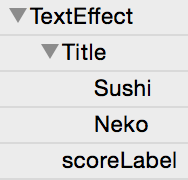

---
title: "Adding a title screen"
slug: title-screen
---     

#Polishing the Gameplay

Now it's time to start turning this into a fully polished game. In the next three steps we will:

<!--#2 is awkwardly phrased-->
1. Add a title screen
2. Add a play button
2. Add tap indicators (how to play)
3. Animate the character with a sprite frame animation
4. Animate the sushi pieces with a keyframe animation
5. Add a game over screen with a score recap

##Getting started

We will need two different animation timelines for our `MainScene`. One for the title screen and another for the tap indicators.

#Adding a Title Screen

##Effect nodes

You'll see a fitting font in your asset pack but it doesn't quite match the pixelated theme of the game. We can fix this with an effect node.

> [action]
> Open up `MainScene.ccb` to get started. Drag in an effect node from the node library on the left.
> 
> Set the node's *content size* to `(100%, 100%)` and *position* to `(0, 0)`. Add a pixelate effect with a *value* of `3`.
> 
> 

Later you can experiment with other effects but this is what we liked best for the style of Sushi Neko.

##Adding a title

Now let's build a title for our game. We didn't include an asset so we'll be using LabelTTF nodes.

> [action]
> Drag a basic node into the timeline as a child of the effect node you added last step. Set its:
> 
> - *content size* to `(100%, 225)`
> - *anchor point* to `(0.5, 1)`
> - *position* to `(50%, 0)`
> - *position reference corner* to `top left`
> 
> 
> 
> Drag in two LabelTTF nodes as children of the node you just added. For the first LabelTTF, set its:
> 
> - *positon* to `(50%, 148)`
> - *label text* to `Sushi`
> - *font name* to `Game of Three.ttf`
> - *font size* to `112`
> - *draw color* to `white`
> - *outline color* to `black`
> - *outline width* to `8`
> 
> 
> 
> For the second LabelTTF, set its:
> 
> - *positon* to `(50%, 70)`
> - *label text* to `Neko`
> - other font properties to match the previous label

##Animating the title

We want the title to drop in from the top to make the start of the game a bit more dynamic. First, let's setup our timeline.

> [action]
> Edit the `DefaultTimeline` to be named `InitialLaunch`.

We will be using keyframe animations to bring the menu in. To do this, we'll need to set a keyframe with the title offscreen and another with the title on screen.

> [action]
> Start off by adding a position keyframe at `00:00:00`. To do this, select the node containing both title labels. Drag the animation scrubber to `00:00:00` (even if it's already there, drag it somewhere else then back). Press `P` on your keyboard. 
> 
<!--gif, get mouseposé from mac app store to display clicks & keystrokes-->
> 
> 
> You can also add keyframes and view their keyboard shortcuts from the *Animation* menu.
> 
> 
> 
> Drag the scrubber to `00:00:25` and press `P` again to add another position keyframe.
> 
> 
> 
> Double click the first keyframe and set its *value* to `(50%, -225)`.

Try pressing play to see how it looks! It looks good but it would look even better with some easing! 

> [info]
> Normally, keyframe animations are linearly interpolated. This means that the animation is run at a constant speed. Changing the interpolation will make the animation run at a varied speed.

> [action]
> Right click between the two keyframes. Choose `Bounce Out` from the menu. This will add a bouncing interpolation.

Play the animation again to see the difference. Feel free to mess with the interpolation and see if you find something you like better!

##Play button

We'll also need a play button now so that the player can move past the title screen.

> [action]
> Drag in a button from the node library. Set its:
> 
> - *position* to `(50%, 42)`
> - *preferred size* to `(101, 63)`
> - *sprite frame* to `button.png` for ALL states
> - *selector* to `ready`

The `ready` function will be used to change the `MainScene` animation to the next timeline we create.

##Cleaning up

The life bar is currently visible. Let's hide it to make the launch look a bit cleaner.

> [action]
> Select `life_bg` from the timeline. Uncheck `Visible`.

It's also good practice to name objects in your timeline with relevant names. You can double click any node's name in the timeline to rename it. Try renaming your new nodes to match the screenshot below!

#Tap Indicators

##Adding the tap sprites

We need to get our tap sprites on the screen before we can animate them.

> [action]
> Drag in a basic node. Set its:
> 
> - *position* to `(0, 0)`
> - *anchor point* to `(0, 0)`
> - *content size* to `(100%, 0)`
> - `doc root var` *code connection* to `tapButtons`
> 
> Drag `tap_left` in as a child of this new node. Set its *position* to `(0, 48)` and *anchor point* to `(-0.2, 0.5)`.
> 
> Drag `tap_right` in also as of your new node. Set its *position* and *anchor point* the same as `tap_left` but use a *position reference corner* of `bottom right`.
> 
> Uncheck `Visible` for both `tap_left` and `tap_right`.

##Creating a new timeline

The tap indicators need to be animated on a separate timeline play their animation after the user taps the play button we added earlier.

> [action]
> Create a new timeline named `Ready` with a length of `00:01:00`. Chain this timeline to itself so that it repeats endlessly.
> 
> 

##Animating the indicators

Let's get started with our animation. We want the tap buttons to move back and forth from left to right so they catch the player's attention.

> [action]
> Start off by adding a visibility keyframe at `00:00:00`. Visibility keyframes flip the visibility from its usual state. In this case, it will make the tap indicator visible since it is not visible by default.
> 
> To do this, select `tap_left`. Drag the animation scrubber to `00:00:00` (even if it's already there, drag it somewhere else then back). Press `V` on your keyboard to add the visibility keyframe.
> 
> While we're at `00:00:00`, press `P` to also add a position keyframe.
> 
> Move the scrubber to `00:00:15` and press `P` again to add another position keyframe. Move the scrubber once more to `00:01:00` and press `P` to add our final position keyframe.

Our initial position is a good starting point for the left-most position during the animation. This means we want to change the middle keyframe to the right-most position we want in our animation. It was move there, back, and then repeat the animation endlessly because we chained the timeline to itself.

> [action]
> Double click the middle position keyframe and set it's value to `(26, 48)`.

Play the animation to check it out! You can enable the looper if you want to see it loop like it will in the simulator.

Now we need to repeat the steps above for `tap_right`.

> [action]
> Follow the same steps above but with `tap_right` selected instead of `tap_left`. The same values will work since `tap_right` already has a *position reference corner* of `bottom right`.

Play your animation one more time to make sure it looks right.

##Cleaning up

The title labels and play button are still visible. We should get rid of them in our `Ready` timeline so the screen looks cleaner and it is clear that you can start playing at any time.

> [action]
> Add a visibility keyframe to the play button and each title label at `00:00:00`. Consult the steps above if you don't remember how to do this.

#Coding the transitions

Now that we have everything set up in SpriteBuilder, open up your project in Xcode so we can add the code needed to get this working.

##Game state

We first want to reconsider the way we track game state. Right now we only have two states: playing and game over. With a title screen we'll probably want a few more

> [action]
> Add the following code near your Side enum:
> 
>       enum GameState {
>           case Title, Ready, Playing, GameOver
>       }
> 
> Change the line:
> 
>       var gameOver = false
> 
> to:
> 
>       var gameState: GameState = .Title
> 
> Now we need to update all the `gameOver` references to use `gameState`
> 
> Change `if gameOver { return }` in `touchBegan` to:
> 
>       if gameState == .GameOver { return }
> 
> Change `if gameOver { return }` in `update` to:
> 
>       if gameState != .Playing { return }
> 
> Change `return gameOver` in `isGameOver()` to:
> 
>       return gameState == .GameOver
> 
> Change `gameOver = true` in `triggerGameOver()` to:
> 
>       gameState = .GameOver

##Play button

Now let's get our play button working.

> [action]
> Add the following method:
> 
>       func ready() {
>           gameState = .Ready
> 
>           self.animationManager.runAnimationsForSequenceNamed("Ready")
> 
>           tapButtons.cascadeOpacityEnabled = true
>           tapButtons.opacity = 0.0
>           tapButtons.runAction(CCActionFadeIn(duration: 0.2))
>       }
> 
> Complete the code connection to `tapButtons` by adding the following near your other instance variables:
> 
>       var tapButtons: CCNode!

This method gets trigger when you press the play button. It updates the game state and then changes the timeline to the second one we made. At the end, we fade the tapButtons in. We would have animated this from SpriteBuilder but it does not currently allow for opacity keyframe animations on button nodes.

> [info]
> `cascadeOpacityEnabled` is set to `false` by default. This means that opacity changes are not passed on to a nodes children unless you set it to true.
  
##Tap to play

Now that we can press the play button and get to the `.Ready` state, we need to find a way to be able to trigger a move to the `.Playing` state to start the timer.

> [action]
> Add the following under `if gameState == .GameOver { return }` in `touchBegan`:
> 
>       if gameState == .Ready { start() }
> 
> Add the following method:
> 
>       func start() {
>           gameState = .Playing
> 
>           tapButtons.runAction(CCActionFadeOut(duration: 0.2))
>       }

##Restart

The only thing left to do is get `restart` working correctly again. As it's currently written, restart will load the title screen again. This doesn't make sense for the flow of the game. It would be better to go straight to the `.Ready` state.

> [action]
> Change the body of `restart` to:
> 
>       var mainScene: MainScene = CCBReader.load("MainScene") as! MainScene
>       mainScene.ready()
> 
>       var scene = CCScene()
>       scene.addChild(mainScene)
> 
>       var transition = CCTransition(fadeWithDuration: 0.3)
> 
>       CCDirector.sharedDirector().replaceScene(scene, withTransition: transition)

Try running the game to see how it looks!

