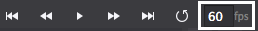

---
title: "Getting fancy with more animations"
slug: game-object-animations
---     

Animating the Cat
=================

We'll be using a sprite frame animation to make the cat chop at the sushi tower. Sprite frame animations are not like keyframe animations, in which you can change an object's properties (like position or rotation) over time. Instead, sprite frame animations change the image that's displayed, usually every frame.

##Setting up the Timelines

First we're going to set up a default animation. That's basically just an animation that starts and ends on frame 0. Any keyframes you set in a default animation will be the state of the object when it's first loaded.

> [action]
> Open up `Character.csd`.
> 
> Create a new animation named `default` that starts and ends at frame 0.

> [action]
> 
With the scrubber on frame 0, activate *automatic frame recording* and drag *character1.png* over to the *Image Resource* property on the right panel. Cocos Studio will create a keyframe for you.

> [action]
> 
Now create a new animation called chop that starts on frame 1 and ends on frame 6.

> [action]
> 
Move the scrubber to frame 1, and again drag *character1.png* to the *Image Resource* property. Do the same with the following frames and images:
>
- Frame 2: *character2.png*
- Frame 3: *character3.png*
- Frame 4: *character2.png*
- Frame 5: *character1.png*
- Frame 6: *leave blank*

Play the animation to check it out!  It's a bit too fast to really see what's happening. Thankfully, we can easily change the speed of the animation. 

> [action]
> 
Find the fps box:
>

>
and slow it down by changing it from 60 fps to 30 fps.

Animating the Sushi Rolls
==========================

As a sushi roll is chopped by the cat, we want to have a nice animation of it flying off the screen.

##Setting up Piece.csd

> [action]
> Open *Piece.csd*.

> [action]
> Create three new animation timelines:
>
<!-- Unfortunately, no markdown table support yet -->
<table>
	<thead>
		<tr>
			<th align="center">Animation Name</th>
			<th align="center">Start Frame</th>
			<th align="center"End Frame/th>
		</tr>
		</thead>
		<tbody>
		<tr>
			<td>default</td>
			<td>0</td>
			<td>0</td>
		</tr>
		<tr>
			<td>moveRight</td>
			<td>1</td>
			<td>48</td>
		</tr>
		<tr>
			<td>moveLeft</td>
			<td>49</td>
			<td>96</td>
		</tr>
	</tbody>
</table>

<!-- 

| Animation Name  | Start Frame | End Frame |
|-----------------|-------------|-----------|
| default         | 0           | 0         |
| moveRight       | 1           | 48        |
| moveLeft        | 49          | 96        |

-->

> [action]
> 
Create a new keyframe for roll at frame 0 that sets its position to (0, 0).

> [solution]
> Don't forget to activate *automatic frame recording*!

##Animating moveRight

> [action]
> 
Move the scrubber to frame 1. Set another roll keyframe at *position* (0, 0). Also at frame 1, set *rotation* to 0. Now, at frame 48, set the roll's position to (800, 200) and its rotation to 120.

Finally, click the keyframe at frame 1 and set its *animation curve* to Sine_EaseOut.

##Animating moveLeft

The animation for moveLeft is the same as moveRight, but it should instead move to the left and rotate counter-clockwise.

> [action]
> Make the moveLeft animation.

Once you're done making moveLeft, set the scrubber back to 0, before saving and publishing. The object will be created with whichever position the scrubber was last on.

Triggering the Chopping In Code
===============================
The animations are ready to go. 

> [action]
> Save and publish to Xcode so we can start coding!

##Cat Chops

To get our `Character` chopping, we'll have to add some new methods and an instance variable.

> [action]
> In *Character.h* declare three new `public` methods:
> 	 
	bool init() override;
   	void onExit() override;
   	void runChopAnimation();
>
> And one new `protected` instance variable:
> 
	cocostudio::timeline::ActionTimeline* timeline;
>
The compiler will complain about not understanding what `ActionTimeline` is, so at the top add the following:
>
	#include "cocostudio/CocoStudio.h"

Now flip over to *Character.cpp*. We're going to load the animation timeline in *init()*.

> [action]
> Add the standard skeleton method for overriding `init()`.

> [solution]
> It should look like this:
> 
	bool Character::init()
	{
	    if (! Node::init())
	    {
	        return false;
	    }
>
	    return true;
	}
	
> [action]
> 
Now, inside `init()`, before the `return true` statement, add the following:
>
    // the character starts on the left side
    this->side = Side::Left;
>   
    // load the character animation timeline
    this->timeline = CSLoader::createTimeline("Character.csb");
>    
    // retain the character animation timeline so it doesn't get deallocated
    this->timeline->retain();

We actually did a bit of a naughty thing earlier by never initializing `side` to a value - now we have fixed that.

The second line loads a timeline, the same way we did in `MainScene`.

The third line is a bit interesting. So far we haven't had to deal with memory management - for the most part Cocos2d-x does a good job of handling it for us. But in this case, the `retain()` call is necessary to ensure that `timeline` doesn't get deallocated.

> [info]
> 
> Cocos2d-x is based on the Objective-C Cocos2d game framework. Cocos2d-x is very similar in many ways, and how it handles memory management is one of them. Because Objective-C is a *reference counted* language, Cocos2d-x also uses *reference counting* to manage the lifecycle of objects in memory.
> 
> Reference counting is actually quite simple. Every object is allocated with a reference count of `1`. If the reference count every drops to `0`, the object is deallocated. Objects can take ownership of other objects by calling `retain()` on them, which simply adds `1` to the reference count. When the first object is done with the owned object, it calls `release()` on it, which subtracts `1` from the reference count. That way, as long as your object has called `retain()` on another object, it shouldn't ever be deallocated until `release()` is called on it.
> 
> For this reason, it's very important to always have a matching `release()` call for every `retain()` call. Otherwise, the over-retained object will never be deallocated, which is considered a *memory leak*.
> 
> Memory management done this way allows for multiple objects to take ownership of a single object. For example, let's say there's a `Node` that  has `retain()` called on it by three different classes. Then the reference count will be 3. The object will remain in memory until all three classes each call `release()`.
> 
> There's things called a *autorelease pools*. Any node added to an autorelease pool will have `release()` called on it at the end of the current frame. All new `Node` or `Node` descendants start with a reference count of 1, and are added to an autorelease pool. That means, that if nothing retains it, then it is deallocated at the end of the current frame when the autorelease pool calls `release()` on it. Why then, have none of our objects so far been automatically deallocated? The answer is that after making each of our objects, we have added it to a `Node` with the `addChild()` method, and `addChild()` calls `retain()` for us.
> 
> The way Cocos2d-x accomplishes reference counting is via the `Ref` class. Nearly every Cocos2d-x class, including `Node`, is a descendent of  `Ref`. `Ref` handles keeping track of the reference count, and implements the `retain()` and `release()` methods.

Because we have a `retain()` call on `timeline`, we need a matching call to `release()`. We will make that call right before `Character` leaves the scene, in the `onExit()` method.

> [action]
> 
Implement `onExit()` like this:
>
	void Character::onExit()
	{
	    // release the retain we called in init
	    this->timeline->release();
>	    
	    Node::onExit();
	}

> [action]
> 
Now we can implement `runChopAnimation()`. When `runChopAnimation()` is called, it should run the `chop` animation that is part of `timeline`. See if you can implement it yourself!

> [solution]
> Your `runChopAnimation()` should look like this:
> 
	void Character::runChopAnimation()
	{
	    // we have to first stop any of the character's running actions so that we can start a new one
	    this->stopAllActions();
>    
	    // we run the timeline so that it gets an update tick every frame
	    this->runAction(this->timeline);
>	    
	    // tell the timeline to play the chop animation, set loop to false
	    this->timeline->play("chop", false);
	}

Now we can start the cat chopping.

> [action]
> 
> Open *MainScene.cpp*. Inside the `GameState::Playing` case in `setupTouchHandling()`, place this code right before `this->stepTower()`:
> 
	this->character->runChopAnimation();

This ensures that `runChopAnimation()` is only called if a valid move has been made and a piece is about to be chopped away. Run the game to see it in action!

<video width="100%" controls>
	<source src="https://s3.amazonaws.com/mgwu-misc/Sushi+Neko+Cpp/chopAnimation.mov" type="video/mp4">
</video>

Trigger the Flying Sushi
========================

Let's create a helper method to call whenever a sushi piece is successful hit.

> [action]
> Add the following method to `MainScene`:
> 
>       func addHitPiece(obstacleSide: Side) {
>           var flyingPiece: Piece = CCBReader.load("Piece") as! Piece
>           flyingPiece.position = piecesNode.positionInPoints
>
>           var animationName = character.side == .Left ? "FromLeft" : "FromRight"
>           flyingPiece.animationManager.runAnimationsForSequenceNamed(animationName)
>           flyingPiece.side = obstacleSide
> 
>           self.addChild(flyingPiece)
>       }

This method loads in a new piece, runs the correct animation, and adds it to the scene. Now we just need to trigger it appropriately.

> [action]
> After `var piece = pieces[pieceIndex]` in `stepTower` add:
> 
>       addHitPiece(piece.side)

Run the game to check out all your fancy animations!